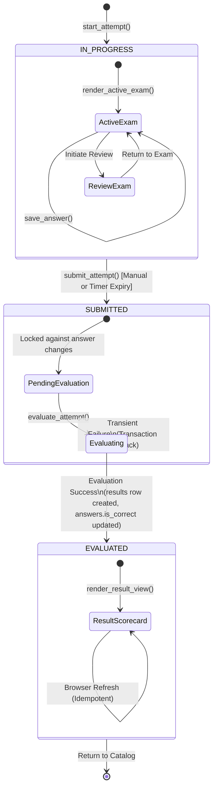

# OmniSight-AI — Active Examination Interface Design Specification
## Part 2C: Automated Grading & Result Scorecard

---

## 1. Purpose and Scope

Following the successful completion, verification, and deployment of:
- **Part 2A**: Exam Catalog & Attempt Initialization
- **Part 2B-1**: Active Exam Foundation & Question Rendering
- **Part 2B-2**: Option Selection, Answer Persistence & Question Navigation
- **Part 2B-3**: Server-Side Deadline Governance & Client Countdown Timer
- **Part 2B-4**: Manual Submission & Exam Review Confirmation Flow

In an academic examination management system, the transition from exam submission to performance evaluation must be instantaneous, mathematically deterministic, tamper-resistant, transactionally protected, and fully explainable. Rather than claiming absolute invulnerability or "tamper-proof" operation, the system establishes concrete security, integrity, and consistency mechanisms:
- **Transaction Atomicity**: All score calculations, answer correctness updates, and result insertions execute within a single atomic database transaction with automatic rollback on error.
- **Duplicate-Evaluation Protection**: State validations reject attempts that are already `EVALUATED` or not in `SUBMITTED` status, preventing duplicate result generation.
- **Role-Based Access Control (RBAC)**: Strict role enforcement restricts examination execution and scorecard viewing to authenticated students.
- **Ownership Validation**: Attempt ownership checks (`attempt["student_id"] == student_id`) guarantee cross-student isolation.
- **Immutable Submitted Answers**: Once an attempt transitions to `SUBMITTED`, all subsequent answer mutations via `save_answer()` are permanently locked and rejected.
- **Relational Integrity & Uniqueness**: MySQL schema constraints (`UNIQUE` constraint on `results.attempt_id`) prevent duplicate result creation at the database engine level.

Examinees require immediate, transparent feedback detailing their overall marks, percentage score, completion metrics, and question-level evaluation outcomes. Simultaneously, academic integrity requires strict authorization controls, prevention of duplicate evaluations, immutable result persistence, and clean separation between student scorecards and administrative oversight.

### 1.1 In-Scope for Part 2C
1. **Lifecycle Transition Governance**:
   - Deterministic progression from `SUBMITTED` $\to$ `EVALUATED`.
   - Exact rules governing when and how evaluation executes.
   - Guaranteed atomic persistence of results and question-level correctness flags.
2. **Deterministic MCQ Grading Engine**:
   - Rigorous mathematical evaluation of student answers against authoritative answer keys.
   - Distinct classification of responses:
     - Correct answers ($+M(q)$ marks)
     - Incorrect answers ($0.0$ marks)
     - Unanswered / skipped questions ($0.0$ marks)
   - Mark summation, weighted question support, and exact percentage calculation rounded to two decimal places.
3. **Database Relational Integrity**:
   - Strict 1:1 relationship between `exam_attempts` and `results` enforced by database schema (`UNIQUE` constraint on `results.attempt_id`).
   - Permanent stamping of `evaluated_at` timestamp.
   - Updating `answers.is_correct` boolean indicators during evaluation.
4. **Service-Layer API Contract**:
   - Full reuse and audit of existing evaluation methods in `src/exam/service.py`:
     - `evaluate_attempt(attempt_id: int, student_id: int) -> Dict[str, Any]`
     - `get_attempt_result(attempt_id: int, student_id: int) -> Dict[str, Any]`
   - Addition of a dedicated scorecard retrieval service method:
     - `get_attempt_scorecard_details(attempt_id: int, student_id: int) -> Dict[str, Any]`
     providing comprehensive student-safe performance breakdowns without SQL in the UI layer.
   - Addition of teacher result inspection service method:
     - `get_exam_results(exam_id: int, teacher_id: int) -> List[Dict[str, Any]]`
     enabling teachers to review submissions and score distributions for their assessments.
5. **Student Result Scorecard UI (`render_result_view`)**:
   - Professional, structured presentation replacing the temporary placeholder in `src/ui/student_ui.py`:
     - **Header & Exam Metadata**: Title, attempt ID, duration taken, submission time, evaluation time.
     - **Performance Metric Cards**: Obtained marks, total marks, percentage score.
     - **Breakdown Summary Cards**: Total questions, correct count, incorrect count, unanswered count.
     - **Detailed Question Review List**: Question-by-question cards displaying question text, student's selected option, correctness badge, and awarded marks.
     - **Navigation & Cleanup**: "Return to Exam Catalog" button resetting transient attempt session states.
6. **Robust Edge Case & Security Handling**:
   - Idempotency and duplicate evaluation protection.
   - Cross-student access isolation (strictly blocking students from viewing peers' results).
   - Graceful resilience against browser reloads, unsubmitted attempts, zero-question exams, and zero-mark exams.
   - Adherence to schema constraints without inventing artificial pass/fail thresholds.

### 1.2 Explicit Non-Scope for Part 2C
- **No Pass/Fail Verdict Generation**: The database schema does not define a passing threshold column for exams. Part 2C displays objective scores and percentages without inventing ungrounded pass/fail judgments.
- **No Proctoring / MediaPipe / OpenCV**: Zero webcam frame processing, facial presence detection, or multi-face flagging (Phase 5).
- **No Behavioral Telemetry**: Zero keystroke analysis, mouse tracking, or tab-switch anomaly detection (Phase 6).
- **No Machine Learning Models**: Zero risk scoring, anomaly classification, or integrity assessment generation (Phases 7–8).
- **No Database Schema Alterations**: Zero changes to existing DDL tables, foreign keys, or column definitions.
- **No Direct SQL in UI**: Strict preservation of presentation and business logic separation.

---

## 2. Examination Result Lifecycle & State Machine

The examination lifecycle follows a strictly unidirectional state machine. Once an attempt transitions to `SUBMITTED`, it enters the final evaluation phase.



### 2.1 State Matrix & Data Permissions

| State | Responsible Service Authority | Modifiable Tables | Read Permissions | Next Permitted State |
| :--- | :--- | :--- | :--- | :--- |
| **`IN_PROGRESS`** | `start_attempt()`, `save_answer()` | `answers` (`selected_option`, `answered_at`) | Student can read own attempt and questions. | `SUBMITTED` |
| **`SUBMITTED`** | `submit_attempt()` | `exam_attempts` (`status = 'SUBMITTED'`, `submitted_at = NOW()`) | Student can view review summary; all answer mutations blocked. | `EVALUATED` |
| **`EVALUATED`** | `evaluate_attempt()` | `answers` (`is_correct`), `results` (INSERT 1 row), `exam_attempts` (`status = 'EVALUATED'`) | Student can read full scorecard; teacher can read exam results. | None (Terminal State) |

### 2.2 Evaluation Triggering Strategies
Two complementary triggers ensure an attempt is evaluated without friction:
1. **Immediate Post-Submission Chaining**:
   - In `render_exam_review()`, immediately following successful execution of `submit_attempt(attempt_id, student_id)`, the client synchronously invokes `evaluate_attempt(attempt_id, student_id)`.
   - On success, `st.session_state["student_view"] = "result"` displays the finalized scorecard immediately.
2. **On-Demand Fallback in Result View**:
   - If an attempt reached `SUBMITTED` via background deadline timeout or if a network disconnect interrupted post-submission chaining, the attempt remains in `SUBMITTED` status.
   - When `render_result_view()` executes, it checks `attempt["status"]`. If status is `'SUBMITTED'`, it automatically executes `evaluate_attempt(attempt_id, student_id)` before rendering the scorecard.
   - This guarantees that students are never permanently trapped in an un-evaluated limbo state.

---

## 3. Existing Evaluation Architecture in `src/exam/service.py`

An extensive audit of `src/exam/service.py` reveals that foundational evaluation logic was already established during earlier phases. Part 2C builds upon and reuses this proven logic rather than reinventing it.

### 3.1 Implemented Method: `evaluate_attempt()`
Located at lines 1303–1456 in `src/exam/service.py`:
- **Validation**: Verifies input types, student role, attempt existence, and attempt ownership (`attempt["student_id"] == student_id`).
- **Precondition Checks**:
  - Rejects with `ValueError` if `attempt["status"] == "EVALUATED"`.
  - Rejects with `ValueError` if `attempt["status"] != "SUBMITTED"`.
  - Queries `results` table and rejects if a record already exists for `attempt_id`.
- **Question & Answer Retrieval**:
  - Fetches all questions for `attempt["exam_id"]` with `correct_option` and `marks`.
  - Fetches recorded student answers for `attempt_id`.
- **Grading Computation**:
  - Iterates through all exam questions.
  - Matches student's `selected_option` (case-insensitive, trimmed) against `correct_option`.
  - Updates `answers.is_correct = TRUE` or `FALSE`.
  - Sums `total_marks` and `obtained_marks`.
  - Computes `percentage = round((obtained_marks / total_marks) * 100, 2)`.
- **Persistence & Atomicity**:
  - Inserts row into `results (attempt_id, total_marks, obtained_marks, percentage, evaluated_at)`.
  - Updates `exam_attempts.status = 'EVALUATED'`.
  - Executes `conn.commit()`.
  - In case of any exception, performs `conn.rollback()`.
- **Return Value**: Clean dictionary with `result_id`, `attempt_id`, `total_marks`, `obtained_marks`, `percentage`, `evaluated_at`, and `status`.

### 3.2 Implemented Method: `get_attempt_result()`
Located at lines 1458–1531 in `src/exam/service.py`:
- **Validation**: Verifies student role and attempt ownership.
- **Query**: Reads from `results` where `attempt_id = %s`.
- **Security**: Masks all question text, options, and answer keys.
- **Return Value**: Dictionary with high-level summary metrics (`result_id`, `attempt_id`, `total_marks`, `obtained_marks`, `percentage`, `evaluated_at`, `status`).

---

## 4. Deterministic MCQ Grading Specification

Objective MCQ assessment requires unambiguous, deterministic mathematical formulation.

### 4.1 Scoring Rules and Category Classifications

Let $Q = \{q_1, q_2, \dots, q_n\}$ be the ordered set of all questions configured for an examination, where $n = |Q| \ge 1$.
For each question $q \in Q$:
- $M(q) \in \mathbb{R}^+$ represents the configured mark weight ($q.\text{marks} \ge 1$).
- $K(q) \in \{'A', 'B', 'C', 'D'\}$ represents the authoritative answer key ($q.\text{correct\_option}$).

Because a student may skip or never visit a question during an examination, **no row is inserted into the `answers` table for unvisited questions**. The system therefore rigorously distinguishes three mutually exclusive evaluation and representation states:

```text
                               ┌─────────────────────────────────────────┐
                               │           Exam Questions (Q)            │
                               └────────────────────┬────────────────────┘
                                                    │
                        ┌───────────────────────────┴───────────────────────────┐
                        ▼                                                       ▼
             ┌─────────────────────────────┐                         ┌─────────────────────┐
             │      Answer Row Exists      │                         │ No Answer Row Exists│
             └──────────────┬──────────────┘                         └──────────┬──────────┘
                            │                                                   │
             ┌──────────────┴──────────────┐                                    │
             ▼                             ▼                                    ▼
   ┌───────────────────┐         ┌───────────────────┐                ┌───────────────────┐
   │ is_correct = TRUE │         │is_correct = FALSE │                │    Unanswered     │
   │ State: CORRECT    │         │ State: INCORRECT  │                │ State: UNANSWERED │
   │ Marks: +M(q)      │         │ Marks: 0.0        │                │ Marks: 0.0        │
   │ Status: ✓ Correct │         │ Status: ✗ Incorrect│               │ Status: ⚠️ Skipped │
   └───────────────────┘         └───────────────────┘                └───────────────────┘
```

1. **Answer Row Exists + `is_correct = TRUE` $\implies$ CORRECT**:
   - The student selected an option that matches the authoritative answer key:
     $$\text{upper}(\text{trim}(a.\text{selected\_option})) = \text{upper}(\text{trim}(K(q)))$$
   - Database Flag: `answers.is_correct = TRUE`
   - Marks Awarded: $W(q) = M(q)$
   - Category: $\text{Category}(q) = \text{CORRECT}$
   - Scorecard Display: Shows question text, option choices, student's selected option, `✓ Correct` status badge, and awarded marks ($+M(q)$).
2. **Answer Row Exists + `is_correct = FALSE` $\implies$ INCORRECT**:
   - The student selected an option that does not match the authoritative answer key:
     $$\text{upper}(\text{trim}(a.\text{selected\_option})) \neq \text{upper}(\text{trim}(K(q)))$$
   - Database Flag: `answers.is_correct = FALSE`
   - Marks Awarded: $W(q) = 0.0$
   - Category: $\text{Category}(q) = \text{INCORRECT}$
   - Scorecard Display: Shows question text, option choices, student's selected option, `✗ Incorrect` status badge, and awarded marks ($0.0$).
3. **No Answer Row Exists $\implies$ UNANSWERED**:
   - The student never visited or answered the question, resulting in no record in the `answers` table for `(attempt_id, question_id)`.
   - Database Flag: No row exists in `answers` (or `selected_option IS NULL`).
   - Marks Awarded: $W(q) = 0.0$
   - Category: $\text{Category}(q) = \text{UNANSWERED}$
   - Scorecard Display: Shows question text, option choices, selected option as `"None (Question Skipped)"`, `⚠️ Unanswered` status badge, and awarded marks ($0.0$).

> [!IMPORTANT]
> **Strict Answer Key Non-Disclosure**: Under no circumstances is the authoritative `correct_option` (answer key) exposed to the student in any of the three states. The student scorecard displays the question text, option choices, student's selected option, correctness status (`CORRECT`, `INCORRECT`, or `UNANSWERED`), and awarded marks, but completely conceals `correct_option` to preserve academic integrity.

### 4.2 Aggregate Metric Formulae

1. **Total Exam Marks ($T$)**:
   $$T = \sum_{q \in Q} M(q)$$
2. **Obtained Marks ($O$)**:
   $$O = \sum_{q \in Q} W(q) = \sum_{q \in Q \mid \text{Category}(q) = \text{CORRECT}} M(q)$$
3. **Percentage Score ($P$)**:
   $$P = \begin{cases}
   \text{round}\left(\frac{O}{T} \times 100, 2\right) & \text{if } T > 0 \\
   0.00 & \text{if } T = 0
   \end{cases}$$
4. **Category Counts**:
   $$N_{\text{total}} = |Q|$$
   $$N_{\text{correct}} = |\{q \in Q \mid \text{Category}(q) = \text{CORRECT}\}|$$
   $$N_{\text{incorrect}} = |\{q \in Q \mid \text{Category}(q) = \text{INCORRECT}\}|$$
   $$N_{\text{unanswered}} = |\{q \in Q \mid \text{Category}(q) = \text{UNANSWERED}\}|$$
   $$\text{Invariant: } N_{\text{total}} = N_{\text{correct}} + N_{\text{incorrect}} + N_{\text{unanswered}}$$

---

## 5. Database Relational Model & Uniqueness Constraints

The database schema (`database/schema.sql`) implements strict integrity constraints to guarantee 1:1 mapping and immutable records.

```text
┌─────────────────────────┐
│          exams          │
├─────────────────────────┤
│ exam_id (PK)            │◄──────┐
│ title                   │       │
│ duration_minutes        │       │
│ created_by (FK -> users)│       │
│ status                  │       │
└─────────────────────────┘       │
             │                    │
             │ (1:N)              │ (1:N)
             ▼                    │
┌─────────────────────────┐       │
│        questions        │       │
├─────────────────────────┤       │
│ question_id (PK)        │       │
│ exam_id (FK)            │       │
│ question_text           │       │
│ option_a .. option_d    │       │
│ correct_option          │       │
│ marks                   │       │
└─────────────────────────┘       │
             ▲                    │
             │ (Graded against)   │
             │                    │
┌─────────────────────────┐       │
│      exam_attempts      │       │
├─────────────────────────┤       │
│ attempt_id (PK)         │◄──┐   │
│ exam_id (FK) ───────────┼───┼───┘
│ student_id (FK -> users)│   │
│ started_at              │   │
│ submitted_at            │   │
│ status                  │   │
└─────────────────────────┘   │
      │           │           │
      │ (1:N)     │ (1:1)     │
      ▼           ▼           │
┌──────────────┐ ┌─────────────────────────┐
│   answers    │ │         results         │
├──────────────┤ ├─────────────────────────┤
│ answer_id(PK)│ │ result_id (PK)          │
│ attempt_id(FK┼─┤ attempt_id (FK, UNIQUE) │
│ question_id(F┼─┤ total_marks (DECIMAL)   │
│ selected_opt │ │ obtained_marks (DECIMAL)│
│ is_correct   │ │ percentage (DECIMAL)    │
│ answered_at  │ │ evaluated_at (DATETIME) │
└──────────────┘ └─────────────────────────┘
```

### 5.1 Invariants Enforced by MySQL Schema
1. **Attempt Uniqueness**: `results.attempt_id` has a `UNIQUE` index constraint (`CONSTRAINT fk_results_attempt_id FOREIGN KEY (attempt_id) REFERENCES exam_attempts(attempt_id)` with `UNIQUE`). A second `INSERT` for the same `attempt_id` fails with a MySQL integrity violation.
2. **Numeric Precision**:
   - `total_marks`: `DECIMAL(7,2) NOT NULL` (supports exams up to 99,999.99 marks).
   - `obtained_marks`: `DECIMAL(7,2) NOT NULL`.
   - `percentage`: `DECIMAL(5,2) NULL` (supports values up to 100.00%).
3. **Temporal Immutability**: `evaluated_at` is set via `NOW()` during result insertion and is never altered.

---

## 6. Service-Layer Design & API Contract Specification

To satisfy **Master Rule 11 (Zero SQL in UI Layer)** and **Requirement 10 (Analysis of Service Methods)**, the service layer in `src/exam/service.py` must encapsulate all query logic, question evaluation joining, and role verification.

### 6.1 Audit of Existing Methods
- `evaluate_attempt(attempt_id: int, student_id: int) -> Dict[str, Any]` (Preserved verbatim).
- `get_attempt_result(attempt_id: int, student_id: int) -> Dict[str, Any]` (Preserved verbatim for lightweight result queries).

### 6.2 New Method: `get_attempt_scorecard_details()`
While `get_attempt_result()` returns high-level metrics (`total_marks`, `obtained_marks`, `percentage`), the detailed scorecard UI requires question-level breakdown data without exposing direct SQL or raw answer keys to unauthorized callers.

```python
def get_attempt_scorecard_details(attempt_id: int, student_id: int) -> Dict[str, Any]:
    """
    Retrieve comprehensive examination result and question breakdown details for an
    authenticated student's evaluated attempt.

    Args:
        attempt_id: Unique attempt identifier.
        student_id: User ID of the requesting student.

    Returns:
        Dict containing:
            - attempt_id: int
            - exam_id: int
            - exam_title: str
            - duration_minutes: int
            - started_at: datetime
            - submitted_at: datetime
            - time_taken_seconds: int
            - evaluated_at: datetime
            - status: str ('EVALUATED')
            - total_marks: float
            - obtained_marks: float
            - percentage: float
            - total_questions: int
            - correct_count: int
            - incorrect_count: int
            - unanswered_count: int
            - questions_breakdown: List[Dict[str, Any]] containing:
                - question_id: int
                - question_text: str
                - option_a: str
                - option_b: str
                - option_c: str
                - option_d: str
                - marks: float
                - selected_option: Optional[str]
                - is_correct: Optional[bool]
                - marks_awarded: float

    Raises:
        ValueError: If attempt or student not found, or attempt is not yet EVALUATED.
        PermissionError: If user is not student or attempt belongs to another student.
    """
```

#### SQL Implementation Details:
The method performs two structured queries:
1. **Header & Result Query**:
   ```sql
   SELECT
       ea.attempt_id, ea.exam_id, ea.started_at, ea.submitted_at, ea.status,
       e.title AS exam_title, e.duration_minutes,
       r.result_id, r.total_marks, r.obtained_marks, r.percentage, r.evaluated_at
   FROM exam_attempts ea
   JOIN exams e ON ea.exam_id = e.exam_id
   JOIN results r ON ea.attempt_id = r.attempt_id
   WHERE ea.attempt_id = %s;
   ```
2. **Question Breakdown Query**:
   ```sql
   SELECT
       q.question_id, q.question_text, q.option_a, q.option_b, q.option_c, q.option_d, q.marks,
       a.selected_option, a.is_correct
   FROM questions q
   LEFT JOIN answers a ON q.question_id = a.question_id AND a.attempt_id = %s
   WHERE q.exam_id = %s
   ORDER BY q.question_id ASC;
   ```
Notice:
- **Base Question Set via LEFT JOIN**: The query conceptually uses the complete question set of the exam (`questions q`) as the primary base and safely associates student responses via `LEFT JOIN answers a ON q.question_id = a.question_id AND a.attempt_id = %s`.
- **Handling Absent Answer Rows**: When a student never visits or never attempts a question, no row exists in `answers`. The `LEFT JOIN` returns `a.selected_option = NULL` and `a.is_correct = NULL`.
- **Three-State Scorecard Transformation**:
  1. `a.selected_option IS NOT NULL AND a.is_correct = TRUE` $\implies$ Category: `CORRECT`, `marks_awarded = float(q.marks)`.
  2. `a.selected_option IS NOT NULL AND a.is_correct = FALSE` $\implies$ Category: `INCORRECT`, `marks_awarded = 0.0`.
  3. `a.selected_option IS NULL` (no answer row exists) $\implies$ Category: `UNANSWERED`, `marks_awarded = 0.0`, `selected_option = None` (rendered as `"None (Question Skipped)"`).
- **Answer Key Security Guarantee**: The authoritative `correct_option` column is strictly excluded from the query projection and omitted from the returned data structure.
  The student scorecard displays:
  - Question text
  - Option choices (A, B, C, D)
  - Student's selected option / status (`selected_option`)
  - Evaluated status badge (`CORRECT`, `INCORRECT`, or `UNANSWERED`)
  - Marks awarded vs max marks
  The system strictly conceals the teacher's authoritative `correct_option` from students.
- **Python-Side Count Aggregation**: Aggregate counters ($N_{\text{correct}}, N_{\text{incorrect}}, N_{\text{unanswered}}$) are calculated in memory during dictionary construction.

### 6.3 New Method: `get_exam_results()` (Teacher Result Visibility)
Currently, `get_attempt_result()` rejects any non-student caller with `PermissionError`. Teachers must have an authorized method to view submission summaries and results for their own exams.

```python
def get_exam_results(exam_id: int, teacher_id: int) -> List[Dict[str, Any]]:
    """
    Retrieve all evaluated student results and submission metadata for an examination
    owned by the requesting teacher.

    Args:
        exam_id: Unique exam identifier.
        teacher_id: User ID of the requesting teacher/admin.

    Returns:
        List of dicts containing:
            - attempt_id: int
            - student_id: int
            - student_name: str
            - student_email: str
            - started_at: datetime
            - submitted_at: datetime
            - status: str
            - total_marks: Optional[float]
            - obtained_marks: Optional[float]
            - percentage: Optional[float]
            - evaluated_at: Optional[datetime]

    Raises:
        ValueError: If exam or teacher not found.
        PermissionError: If user is not teacher/admin or does not own the exam.
    """
```

---

## 7. Result Scorecard UI Specification (`render_result_view`)

When `student_view == "result"`, the dedicated presentation function `render_result_view(student_id: int, attempt_id: Optional[int])` renders the comprehensive scorecard interface.

### 7.1 Visual Layout & ASCII Wireframe

```text
+----------------------------------------------------------------------------------------------------+
| 🎓 Examination Scorecard                                                            [Attempt #19]  |
| CS101 — Introduction to Computer Science                                          Completed Exam   |
+----------------------------------------------------------------------------------------------------+
| [ METADATA CONTAINER ]                                                                             |
| Started: 2026-09-27 10:00:00  |  Submitted: 2026-09-27 10:42:15  |  Time Taken: 42m 15s            |
| Evaluated: 2026-09-27 10:42:16 |  Status: EVALUATED                                                |
+----------------------------------------------------------------------------------------------------+
|  +-------------------------+  +-------------------------+  +-------------------------+             |
|  |     Obtained Score      |  |       Percentage        |  |     Completion Rate     |             |
|  |       16.0 / 20.0       |  |         80.00%          |  |       10 / 10 (100%)    |             |
|  +-------------------------+  +-------------------------+  +-------------------------+             |
+----------------------------------------------------------------------------------------------------+
|  +-------------------------+  +-------------------------+  +-------------------------+             |
|  |    ✓ Correct Answers    |  |   ✗ Incorrect Answers   |  |  ⚠️ Unanswered Items    |             |
|  |            8            |  |            2            |  |            0            |             |
|  +-------------------------+  +-------------------------+  +-------------------------+             |
+----------------------------------------------------------------------------------------------------+
| ---------------------------------- QUESTION BREAKDOWN -------------------------------------------- |
|                                                                                                    |
| +------------------------------------------------------------------------------------------------+ |
| | Question 1 of 10                                                   [ ✓ Correct ]  [ 2.0 / 2.0 ] | |
| | What is the time complexity of binary search on a sorted array?                                | |
| | Your Answer: Option B (O(log n))                                                               | |
| +------------------------------------------------------------------------------------------------+ |
|                                                                                                    |
| +------------------------------------------------------------------------------------------------+ |
| | Question 2 of 10                                                 [ ✗ Incorrect ]  [ 0.0 / 2.0 ] | |
| | Which data structure operates on a First-In, First-Out (FIFO) basis?                           | |
| | Your Answer: Option A (Stack)                                                                  | |
| +------------------------------------------------------------------------------------------------+ |
|                                                                                                    |
| +------------------------------------------------------------------------------------------------+ |
| | Question 3 of 10                                                 [ ⚠️ Unanswered ] [ 0.0 / 1.0 ] | |
| | Define idempotent operations in RESTful architecture.                                           | |
| | Your Answer: None (Question Skipped)                                                           | |
| +------------------------------------------------------------------------------------------------+ |
|                                                                                                    |
+----------------------------------------------------------------------------------------------------+
| [ 🏠 Return to Examination Catalog ]                                                               |
+----------------------------------------------------------------------------------------------------+
```

### 7.2 UI Component Breakdown

1. **Top Header & Status Banner**:
   - `st.title("🎓 Examination Scorecard")`
   - Subtitle with `exam_title` and `attempt_id`.
   - Congratulatory/completion notice indicating permanent evaluation.
2. **Metadata Summary Container (`st.container(border=True)`)**:
   - Displayed across 3–4 columns using `st.caption` or small markdown:
     - Started Timestamp
     - Submitted Timestamp
     - Time Elapsed (formatted as `Xm Ys`)
     - Evaluated Timestamp
3. **Primary Performance KPI Metrics (`st.columns(3)`)**:
   - Column 1: `st.metric("Score", f"{obtained_marks} / {total_marks}")`
   - Column 2: `st.metric("Percentage", f"{percentage:.2f}%")`
   - Column 3: `st.metric("Answered", f"{answered_count} / {total_questions}")`
4. **Answer Breakdown Counters (`st.columns(3)`)**:
   - Column 1: Styled green metric or callout: `✓ Correct: {correct_count}`
   - Column 2: Styled red metric or callout: `✗ Incorrect: {incorrect_count}`
   - Column 3: Styled amber/gray metric or callout: `⚠️ Unanswered: {unanswered_count}`
5. **Question-by-Question Review Containers**:
   - Iterates through `questions_breakdown`.
   - Each question rendered in an individual `st.container(border=True)`:
     - Top row (`st.columns([3, 1, 1])`): Question index & text snippet, correctness badge, marks earned vs max marks.
     - Option details: Displays the student's selected option text (e.g., `Option B: O(log n)`) or `"None (Question Skipped)"` when no answer row exists.
     - Color-coded left border or badge:
       - Green (`#2E7D32`) for Correct (`✓ Correct`).
       - Red (`#D32F2F`) for Incorrect (`✗ Incorrect`).
       - Amber (`#ED6C02`) for Unanswered (`⚠️ Unanswered`).
6. **Answer Key Disclosure Policy**:
   - **Academic Standard**: In high-stakes testing, revealing the authoritative answer key (`correct_option`) while exams are actively published risks collusion with other students who have not yet taken the exam.
   - **Implemented Policy**: The scorecard displays the question text, all option choices, the student's selected option, whether it was correct, incorrect, or unanswered, and the awarded marks. The teacher's authoritative correct answer key (`correct_option`) is strictly concealed and never exposed to the examinee.
7. **Action & Navigation Controls**:
   - Button: `[ 🏠 Return to Examination Catalog ]` (`type="primary"`, `use_container_width=True`).
   - Handler: Clears `view_result_attempt_id`, sets `student_view = "catalog"`, and invokes `st.rerun()`.

---

## 8. Edge Case Analysis & Exception Handling Matrix

| Scenario / Edge Case | Precondition | Expected System Behavior | Visual Feedback to User |
| :--- | :--- | :--- | :--- |
| **Standard Evaluation** | Attempt is `SUBMITTED`, all questions answered. | `evaluate_attempt()` computes score, inserts into `results`, status $\to$ `EVALUATED`. | Full scorecard displayed with 100% completion rate. |
| **All Questions Unanswered** | Attempt submitted with 0 answers. | Evaluates all questions as incorrect, `obtained_marks = 0.0`, `percentage = 0.0%`. | Scorecard displays `0.0 / Total`, `0.0%`, with amber unanswered warnings. |
| **Partial Completion** | Some questions answered, some skipped. | Answered questions graded normally; skipped items receive 0 marks. | Question breakdown reflects mixed green/red/amber cards. |
| **Already Evaluated Attempt** | Attempt status is already `EVALUATED`. | `evaluate_attempt()` is skipped; `get_attempt_scorecard_details()` fetches existing result. | Scorecard displays immediately without database mutation. |
| **Attempt in `IN_PROGRESS` Status** | Student tries to navigate to result view while exam is active. | Rejected; student redirected to `active_exam` or `catalog`. | Warning: *"Examination is still in progress."* |
| **Cross-Student Access Attempt** | Student B enters `attempt_id` belonging to Student A. | `get_attempt_scorecard_details()` raises `PermissionError`. | Error: *"Unauthorized: You do not have permission to access this result."* |
| **Non-Student Role Access** | Teacher or anonymous user invokes student result method. | Service raises `PermissionError` (`user_role != 'student'`). | Error: *"Access Denied: Only students may access this scorecard."* |
| **Zero-Mark Exam Edge Case** | Total marks of exam sum to `0.0`. | Service avoids ZeroDivisionError: sets `percentage = 0.0`. | Scorecard displays `0.0 / 0.0 (0.00%)`. |
| **Browser Refresh on Result Page** | User presses F5 / browser reload while on scorecard. | Session state retains `view_result_attempt_id`; view re-executes idempotently. | Scorecard renders identically with zero side effects. |
| **Teacher Views Results** | Teacher accesses results for their own published/closed exam. | `get_exam_results(exam_id, teacher_id)` returns student attempt summaries. | Teacher Exam Studio displays student roster with scores. |

---

## 9. Passing Threshold & Academic Integrity Policy (Requirement 7)

A crucial architectural principle for OmniSight-AI is strict adherence to schema reality:
1. **Schema Fact**: The `exams` table schema (`exam_id, title, description, duration_minutes, created_by, status, created_at`) contains **no column** for `passing_marks`, `pass_percentage`, or `passing_grade`.
2. **Design Invariant**: The system **must not invent** an arbitrary pass/fail threshold (e.g. 40% or 50%).
3. **Scorecard Policy**: The result scorecard presents purely objective quantitative data:
   - Obtained Marks / Total Marks
   - Percentage Score
   - Question-by-question breakdown
4. **No Arbitrary Badges**: The UI must not display "PASSED" or "FAILED" badges. The status badge displays "COMPLETED" or "EVALUATED".
5. **Future Extension**: If instructors require configurable pass/fail criteria, it will be added in a future phase via a formal schema migration (`ALTER TABLE exams ADD COLUMN passing_percentage DECIMAL(5,2)`).

---

## 10. System Preservation & Architectural Invariants

### 10.1 Preservation of Part 2B-4 (Manual Submission Invariants)
- `submit_attempt()` remains the sole authority for terminating active test sessions, updating `submitted_at`, and transitioning `IN_PROGRESS` $\to$ `SUBMITTED`.
- `evaluate_attempt()` operates strictly downstream of `submit_attempt()`.
- If evaluation encounters a transient server failure, the attempt remains locked as `SUBMITTED`—the student cannot reopen or modify answers. Evaluation can be safely retried upon subsequent page load.

### 10.2 Preservation of Part 2B-3 (Timing Governance Invariants)
- All timing calculations, deadline enforcements, and countdown timers terminate upon submission.
- The scorecard calculates elapsed test duration statically:
  $$\text{Time Taken} = \text{submitted\_at} - \text{started\_at}$$
- No active JavaScript timer widgets, background countdown threads, or auto-submit listeners exist on the result page.

### 10.3 Presentation / Service Layer Boundary
- `src/ui/student_ui.py` contains **zero direct SQL statements** and **zero database connection logic**.
- All data retrieval is performed via `src/exam/service.py` functions:
  - `get_attempt_scorecard_details(attempt_id, student_id)`
  - `get_attempt_result(attempt_id, student_id)`
  - `evaluate_attempt(attempt_id, student_id)`

---

## 11. Implementation Roadmap & Gap Analysis

To guide implementation in Part 2C, the codebase is audited below:

| Component | Current State | Required Work in Part 2C |
| :--- | :--- | :--- |
| **`evaluate_attempt()`** | **Already Implemented** in `src/exam/service.py` (lines 1303–1456). Fully functional, calculates marks, sets `answers.is_correct`, inserts `results`. | Retain without modification. |
| **`get_attempt_result()`** | **Already Implemented** in `src/exam/service.py` (lines 1458–1531). Returns high-level summary metrics. | Retain without modification. |
| **`get_attempt_scorecard_details()`** | **Not Implemented**. No method currently provides joined question-level breakdown with correctness flags. | **Implement in `src/exam/service.py`** to power the detailed student scorecard. |
| **`get_exam_results()`** | **Not Implemented**. Teachers have no method to view student results for their exams. | **Implement in `src/exam/service.py`** for teacher visibility. |
| **`render_result_view()`** | **Temporary Placeholder** in `src/ui/student_ui.py` (lines 1146–1167). | **Implement in `src/ui/student_ui.py`** with metadata container, KPI metrics, category counters, and question breakdown cards. |
| **Teacher Result UI** | **Not Implemented** in `src/ui/teacher_ui.py`. | Add a "Results & Submissions" tab in `teacher_ui.py` using `get_exam_results()`. |

---

## 12. Comprehensive Test Plan & Verification Scenarios

### 12.1 Automated Test Suite Scenarios (`tests/test_automated_grading.py`)

1. **Test Standard Evaluation & Marking**:
   - Author a 3-question exam with marks (2, 3, 5) $\implies$ Total Marks = 10.0.
   - Student submits: Q1 correct, Q2 incorrect, Q3 correct $\implies$ Obtained = 7.0, Percentage = 70.00%.
   - Verify `evaluate_attempt()` inserts row into `results` with exact values.
   - Verify `exam_attempts.status` transitions to `'EVALUATED'`.
   - Verify `answers.is_correct` flags match (TRUE, FALSE, TRUE).
2. **Test Scorecard Retrieval Service Contract**:
   - Invoke `get_attempt_scorecard_details()`.
   - Verify returned dictionary contains all required fields: metadata, metrics, category counts (2 correct, 1 incorrect, 0 unanswered), and 3 breakdown items.
3. **Test All Unanswered Submission**:
   - Student submits exam without selecting any answers.
   - Verify `obtained_marks = 0.0`, `percentage = 0.0%`, `unanswered_count = 3`.
4. **Test Idempotent Evaluation**:
   - Calling `evaluate_attempt()` on an already evaluated attempt raises `ValueError` ("Cannot evaluate attempt: Attempt has already been EVALUATED.").
   - Result row count in `results` remains exactly 1.
5. **Test Precondition Enforcements**:
   - Calling `evaluate_attempt()` on an `IN_PROGRESS` attempt raises `ValueError`.
   - Calling `get_attempt_scorecard_details()` on an `IN_PROGRESS` attempt raises `ValueError`.
6. **Test Cross-Student Isolation**:
   - Authenticate Student 1 (owner) and Student 2 (unauthorized).
   - Student 2 calling `get_attempt_scorecard_details(attempt_id_1, student_2_id)` raises `PermissionError`.
7. **Test Teacher Results Retrieval**:
   - Teacher who created the exam invokes `get_exam_results(exam_id, teacher_id)`.
   - Verify student attempt record, marks, and evaluation timestamp are returned.
   - Another teacher invoking `get_exam_results()` raises `PermissionError`.
8. **Test UI Scorecard Rendering**:
   - Execute synthetic Streamlit session test simulating `render_result_view()`.
   - Verify no unhandled exceptions, correct KPI metric calculations, and clean return to catalog.

### 12.2 Regression Suite Checks
- Verify Part 2A: Catalog browsing, attempt initialization, single active attempt limit.
- Verify Part 2B-1: Active exam question loading and navigation.
- Verify Part 2B-2: Answer selection, debounced persistence, and palette status updates.
- Verify Part 2B-3: Server deadline enforcement and countdown timer rendering.
- Verify Part 2B-4: Review confirmation screen, unanswered question warnings, and irreversible submission locks.
