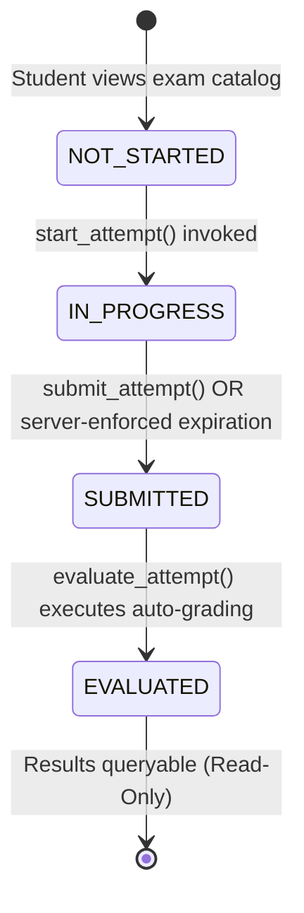
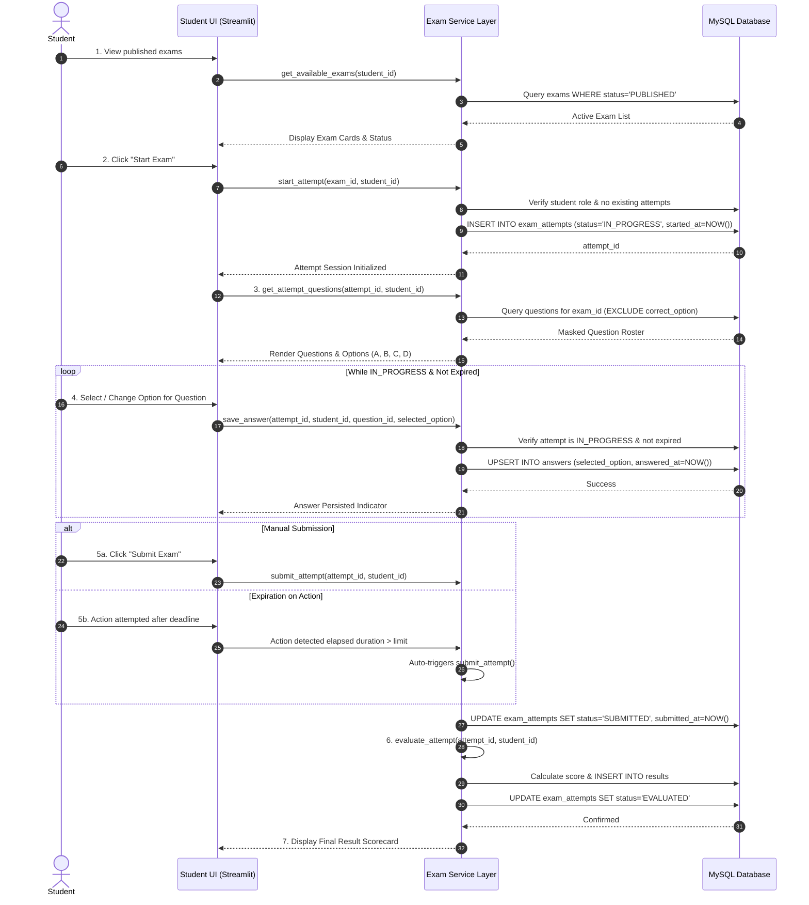

# OmniSight-AI — Student Exam Attempt & Submission System Design Specification

## 1. Purpose and Scope

The **Student Exam Attempt & Submission Subsystem** defines the operational lifecycle, data flow, timing governance, authorization model, and evaluation mechanics for student participation in examinations within OmniSight-AI.

Following the completion of Teacher Exam CRUD (Step 2A) and Question Management CRUD (Step 2B), this subsystem establishes the student assessment workflow:
- Browsing published examinations.
- Initiating single-attempt timed examination sessions.
- Retrieving sanitized question rosters (strict exclusion of correct answer keys).
- Persisting and updating selected answers during active sessions.
- Finalizing and submitting attempts under server-enforced time constraints.
- Executing deterministic, objective scoring and persisting verified results.

This document serves as the architectural and business rules contract for the upcoming service-layer implementation in `src/exam/service.py`.

---

## 2. Student Exam Attempt Lifecycle

An examination attempt tracks the concrete progression of an authenticated student taking a specific published examination.



### 2.1 State Definitions & Transition Invariants

| Lifecycle State | Database Representation | Triggering Action | Allowed Operations | Data Mutability |
| :--- | :--- | :--- | :--- | :--- |
| **`NOT_STARTED`** | *No record exists in `exam_attempts`* | Student views published exam listing | View exam metadata (title, duration, instructions, question count). | N/A |
| **`IN_PROGRESS`** | `exam_attempts.status = 'IN_PROGRESS'`<br>`started_at = NOW()`<br>`submitted_at = NULL` | `start_attempt()` | Fetch masked questions, save/update answers, view elapsed time. | **Mutable**: Answers can be created, modified, or cleared. |
| **`SUBMITTED`** | `exam_attempts.status = 'SUBMITTED'`<br>`submitted_at = NOW()` | `submit_attempt()` or auto-submission on expiration | Immediate handoff to evaluation pipeline. | **Immutable**: Answer modifications strictly rejected. |
| **`EVALUATED`** | `exam_attempts.status = 'EVALUATED'`<br>`results` record created | `evaluate_attempt()` | View obtained score, total marks, percentage, and summary. | **Terminal & Immutable**: Attempt and result records permanently locked. |

---

## 3. End-to-End Student Workflow

The execution flow coordinates the Student UI, Examination Service Layer, and MySQL Database:



---

## 4. Attempt Initiation Rules (`start_attempt`)

When a student requests to begin an examination, the following validation chain must execute atomically:

1. **Authentication & Identity**:
   - The user must be authenticated.
   - The user's role must be strictly `student`. `teacher` and `admin` roles cannot initiate student exam attempts.
2. **Examination Status & Existence**:
   - The targeted `exam_id` must exist.
   - The examination `status` must be strictly `PUBLISHED`. Attempts cannot be created for `DRAFT` or `CLOSED` exams.
3. **Question Availability**:
   - The examination must have at least one question defined (`COUNT(questions) >= 1`).
4. **Single Attempt Constraint (MVP Policy)**:
   - For the OmniSight-AI MVP, an examinee is restricted to **exactly one attempt** per examination.
   - Query: `SELECT attempt_id, status FROM exam_attempts WHERE exam_id = %s AND student_id = %s`.
   - If an attempt already exists (whether `IN_PROGRESS`, `SUBMITTED`, or `EVALUATED`), initiation is rejected with a `ValueError("You have already initiated or completed an attempt for this examination.")`.
5. **Persistence**:
   - `INSERT INTO exam_attempts (exam_id, student_id, started_at, submitted_at, status) VALUES (%s, %s, NOW(), NULL, 'IN_PROGRESS')`.
   - Return structured attempt dictionary.

---

## 5. Question Delivery & Answer Management

### 5.1 Masked Question Roster (`get_attempt_questions`)
- Students taking an exam must receive the complete list of questions and choices.
- **Security Requirement**: The column `correct_option` must **never** be retrieved or sent to the client.
- The returned dictionary per question contains:
  - `question_id`
  - `exam_id`
  - `question_text`
  - `option_a`, `option_b`, `option_c`, `option_d`
  - `marks`
  - *(Optional existing response)*: `selected_option` from the `answers` table if previously saved.

### 5.2 Answer Persistence (`save_answer`)
- As students answer questions, selections are persisted immediately.
- **Validation**:
  - `attempt_id` must exist and belong to the calling `student_id`.
  - The attempt `status` must be `IN_PROGRESS`.
  - The server-side elapsed time must not exceed the exam duration.
  - `question_id` must belong to the `exam_id` associated with this `attempt_id`.
  - `selected_option` must be one of `['A', 'B', 'C', 'D']` or `None` (clearing a selection).
- **Storage Strategy**:
  - Check whether a record already exists in `answers` for `(attempt_id, question_id)`.
  - If existing: `UPDATE answers SET selected_option = %s, answered_at = NOW() WHERE attempt_id = %s AND question_id = %s`.
  - If new: `INSERT INTO answers (attempt_id, question_id, selected_option, is_correct, answered_at) VALUES (%s, %s, %s, NULL, NOW())`.
  - `is_correct` remains `NULL` until evaluation.

---

## 6. Submission & Auto-Submission Rules (`submit_attempt`)

1. **Submission Eligibility**:
   - The attempt must exist and belong to the requesting student.
   - The attempt `status` must be `IN_PROGRESS`. Re-submitting an already `SUBMITTED` or `EVALUATED` attempt raises `ValueError`.
2. **Transition**:
   - Set `submitted_at = NOW()`.
   - Set `status = 'SUBMITTED'`.
3. **Immutability Enforcement**:
   - Once marked `SUBMITTED`, no further calls to `save_answer()` are permitted.
4. **Trigger for Immediate Evaluation**:
   - In OmniSight-AI, objective MCQ scoring is deterministic and fast. Therefore, `submit_attempt()` will immediately invoke or chain into `evaluate_attempt()`.

---

## 7. Server-Side Timing & Expiration Management

Client-side timers in web browsers (and Streamlit rerun cycles) can be manipulated, desynchronized, or paused by users. Therefore, **all timing governance is strictly server-side**.

### 7.1 Timing Calculation
For an attempt with `started_at` and parent exam with `duration_minutes`:
$$\text{Deadline} = \text{started\_at} + (\text{duration\_minutes} \times 60 \text{ seconds})$$
$$\text{Remaining Seconds} = \max\left(0, \text{Deadline} - \text{NOW}()\right)$$

### 7.2 Grace Period Policy
Network latency, database roundtrips, and Streamlit execution loops may introduce slight transmission delays. A server-side **grace period of 60 seconds** is permitted for in-flight requests:
$$\text{Maximum Allowed Submission Time} = \text{Deadline} + 60 \text{ seconds}$$

### 7.3 Expiration Handling Strategy
In the Streamlit + MySQL architecture without background workers or distributed cron daemons:
- **Lazy/On-Access Expiration**:
  - Whenever `save_answer()` or `submit_attempt()` is called, the service layer computes `NOW() - started_at`.
  - If `NOW() > Deadline + Grace Period`:
    1. Any new answer payload in `save_answer()` is rejected.
    2. The attempt status is automatically transitioned: `UPDATE exam_attempts SET status = 'SUBMITTED', submitted_at = started_at + INTERVAL duration_minutes MINUTE WHERE attempt_id = %s`.
    3. Auto-evaluation is triggered for all answers recorded prior to expiry.
    4. An `ExamExpiredError` (or `ValueError("Exam duration has expired. Your attempt has been automatically submitted.")`) is raised/returned.
- **Client UI Synchronization**:
  - The UI requests remaining seconds from `get_attempt()` and displays a countdown timer.
  - When the countdown reaches zero, the UI automatically triggers `submit_attempt()`.

---

## 8. Deterministic Objective Evaluation (`evaluate_attempt`)

### 8.1 Auto-Grading Algorithm
1. Fetch all questions belonging to `exam_attempts.exam_id`:
   - `SELECT question_id, correct_option, marks FROM questions WHERE exam_id = %s`.
2. Fetch all student answers for the attempt:
   - `SELECT question_id, selected_option FROM answers WHERE attempt_id = %s`.
3. Initialize accumulators:
   - $\text{Total Marks} = \sum \text{question.marks}$
   - $\text{Obtained Marks} = 0.0$
4. For each question:
   - Find corresponding answer in `answers` (if any).
   - If answer exists and `selected_option.upper() == correct_option.upper()`:
     - Mark `is_correct = TRUE` in `answers`.
     - $\text{Obtained Marks} += \text{question.marks}$.
   - Else:
     - Mark `is_correct = FALSE` (or keep NULL/False for unanswered questions).
5. Compute Percentage:
   $$\text{Percentage} = \begin{cases} \left(\frac{\text{Obtained Marks}}{\text{Total Marks}}\right) \times 100 & \text{if } \text{Total Marks} > 0 \\ 0.0 & \text{otherwise} \end{cases}$$
6. Persist to `results` table:
   - `INSERT INTO results (attempt_id, total_marks, obtained_marks, percentage, evaluated_at) VALUES (%s, %s, %s, %s, NOW())`.
7. Update attempt status:
   - `UPDATE exam_attempts SET status = 'EVALUATED' WHERE attempt_id = %s`.

---

## 9. Role-Based Access Control (RBAC) & Security Boundaries

| Operation | Student | Teacher (Owner) | Teacher (Non-Owner) | Admin |
| :--- | :---: | :---: | :---: | :---: |
| **`start_attempt()`** | Allowed (own) | Denied | Denied | Denied |
| **`get_attempt()`** | Allowed (own) | Allowed (exam owner) | Denied | Allowed |
| **`get_attempt_questions()`** | Allowed (own, masked) | Allowed (masked) | Denied | Allowed |
| **`save_answer()`** | Allowed (own, active) | Denied | Denied | Denied |
| **`submit_attempt()`** | Allowed (own, active) | Denied | Denied | Allowed (force) |
| **`evaluate_attempt()`** | Allowed (system trigger) | Allowed | Denied | Allowed |
| **`get_attempt_result()`** | Allowed (own) | Allowed (exam owner) | Denied | Allowed |

### Key Security Invariants:
- **No Answer Key Leakage**: Service functions handling student requests (`get_attempt_questions`, `save_answer`, `get_attempt`) must omit `correct_option` entirely from `SELECT` projections.
- **Cross-Student Isolation**: A student can never view another student's attempt, answers, or results.
- **Teacher Boundaries**: A teacher can only view attempts and results for exams they personally created (`exams.created_by == teacher_id`).

---

## 10. Service Layer API & Function Boundaries

The following functions will be implemented in `src/exam/service.py` during Step 2C:

### 10.1 `start_attempt`
```python
def start_attempt(exam_id: int, student_id: int) -> Dict[str, Any]:
    """
    Initiate a new examination attempt for an authenticated student.
    Validates exam is PUBLISHED, user has role 'student', and no prior attempt exists.
    Initializes attempt record with status='IN_PROGRESS'.
    """
```

### 10.2 `get_attempt`
```python
def get_attempt(attempt_id: int, user_id: int) -> Optional[Dict[str, Any]]:
    """
    Retrieve attempt metadata (exam_id, student_id, started_at, submitted_at, status, duration, remaining_seconds).
    Enforces authorization: examinee, exam creator, or admin.
    """
```

### 10.3 `get_attempt_questions`
```python
def get_attempt_questions(attempt_id: int, student_id: int) -> List[Dict[str, Any]]:
    """
    Retrieve all questions for the attempt with answer keys strictly stripped.
    Includes student's currently saved selected_option for each question.
    """
```

### 10.4 `save_answer`
```python
def save_answer(
    attempt_id: int,
    student_id: int,
    question_id: int,
    selected_option: Optional[str]
) -> Dict[str, Any]:
    """
    Persist or update a student's answer selection for a question.
    Validates attempt is IN_PROGRESS, exam has not expired, and option in ('A', 'B', 'C', 'D', None).
    """
```

### 10.5 `submit_attempt`
```python
def submit_attempt(attempt_id: int, student_id: int) -> Dict[str, Any]:
    """
    Transition attempt from IN_PROGRESS to SUBMITTED.
    Records submitted_at timestamp and triggers evaluate_attempt().
    """
```

### 10.6 `evaluate_attempt`
```python
def evaluate_attempt(attempt_id: int, user_id: int) -> Dict[str, Any]:
    """
    Grade all submitted answers against correct_option.
    Updates answers.is_correct, inserts single row into results, and updates attempt status to EVALUATED.
    """
```

### 10.7 `get_attempt_result`
```python
def get_attempt_result(attempt_id: int, user_id: int) -> Optional[Dict[str, Any]]:
    """
    Retrieve finalized results (total_marks, obtained_marks, percentage, evaluated_at).
    Enforces authorization: examinee, exam creator, or admin.
    """
```

---

## 11. Error Handling Matrix

| Error Scenario | Service Exception | HTTP/UI Message |
| :--- | :--- | :--- |
| **Exam Not Found** | `ValueError` | "Examination not found." |
| **Exam Not Published** | `ValueError` | "Examination is not open for attempts (Status: DRAFT/CLOSED)." |
| **Unauthorized Role** | `PermissionError` | "Only registered students can attempt examinations." |
| **Duplicate Attempt** | `ValueError` | "You have already initiated or completed an attempt for this examination." |
| **Invalid Question** | `ValueError` | "Question does not belong to this examination." |
| **Invalid Option Key** | `ValueError` | "Invalid option selected. Must be A, B, C, or D." |
| **Modification Post-Submission** | `ValueError` | "Cannot modify answers: Attempt has already been submitted." |
| **Expired Attempt** | `ValueError` | "Examination time has expired. Your attempt has been submitted." |
| **Cross-User Access** | `PermissionError` | "Unauthorized: You do not have permission to view or modify this attempt." |

---

## 12. Forward Integration & Architecture Traceability

The data structures designed here anchor all subsequent project phases:

```text
exam_attempts (Phase 4)
  │
  ├───(1:N)───► monitoring_events (Phase 5: CV / Proctoring signals: face missing, tab switch)
  │                   │
  │                   ▼
  ├───(1:1)───► behavioral_features (Phase 6: Aggregated signals: switch count, anomaly rates)
  │                   │
  │                   ▼
  └───(1:1)───► integrity_assessments (Phase 7: ML Risk Score & Explainable Breakdown)
```

1. **`exam_attempts.attempt_id`** serves as the central session identity.
2. In **Phase 5**, webcam monitoring events will link directly to `attempt_id`.
3. In **Phase 6 & 7**, time differences between `answered_at` timestamps will feed response-time behavioral feature extraction.
4. In **Phase 8**, the final teacher dashboard will present the evaluated test score alongside the integrity risk score.

---

## 13. Explicit Non-Scope for Phase 4 Step 2C

To preserve system simplicity and follow the phased development roadmap, the following are **strictly excluded**:
- **No Video / Camera Ingestion**: No OpenCV, MediaPipe, or webcam frames.
- **No Proctoring Signals**: No face detection, multi-face alerts, or tab-switch logging.
- **No Behavioral ML Modeling**: No risk scoring or heuristic penalty calculations.
- **No Complex Polling / WebSockets**: Standard synchronous Streamlit state queries.
- **No Streamlit UI Implementation**: Step 2C focuses exclusively on service-level logic and database transactions.
