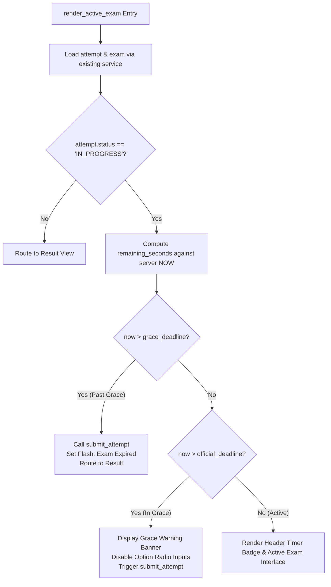

# OmniSight-AI — Active Examination Interface Design Specification
## Part 2B-3: Server-Side Deadline Governance & Client Countdown Timer

---

## 1. Purpose and Scope

Following the implementation and verification of **Part 2B-1** (Active Exam Foundation & Question Rendering) and **Part 2B-2** (Option Selection, Answer Persistence & Question Navigation), this document establishes the detailed architectural and technical design for **Part 2B-3: Server-Side Deadline Governance & Client Countdown Timer**.

In an online computer-based examination system, rigorous time enforcement is a foundational academic integrity requirement. This specification defines the separation between the authoritative server-side deadline and the client-side countdown timer, establishes automatic submission triggers, and guarantees that client-side manipulation (e.g. clock tampering, paused JavaScript, or browser refreshes) can never extend the examination window.

### 1.1 In-Scope for Part 2B-3
1. **Server-Side Timing Authority**: Deriving the official deadline and grace deadline strictly from MySQL `started_at` and `duration_minutes`.
2. **Authoritative vs. Presentation Separation**: Enforcing timing checks on the server; treating client countdown strictly as a visual display.
3. **Time Remaining Calculation**: Computing remaining seconds dynamically on every server rerun.
4. **Visual Countdown Timer Header**: Displaying a prominent countdown clock with clear visual states (Normal, Warning <5 mins, Expired).
5. **Client-Side Smooth Ticking**: Providing a non-blocking browser countdown via isolated client JavaScript that does not congest Streamlit rerun cycles.
6. **Grace Period Management**: Maintaining the established 60-second grace window for in-flight answer transmissions.
7. **Auto-Submission Integration**: Triggering `submit_attempt()` when the examination window lapses.
8. **Reconnection & Refresh Resilience**: Guaranteeing that browser reloads or network reconnections cannot add time to the examination session.
9. **Interception of Expired Sessions**: Barring active question presentation for already-expired attempts upon page load.
10. **Preservation of Part 2B-2 Controls**: Maintaining seamless compatibility with option selection, answer persistence (`save_answer`), sequential navigation, and the Question Palette.
11. **Strict UI/Service Layer Separation**: Zero SQL queries in `src/ui/student_ui.py`.

### 1.2 Explicit Non-Scope for Part 2B-3
- **No Evaluation / Auto-Scoring**: Calculation of marks and generation of result scorecard records is reserved for **Part 2B-4** / **Part 2C**.
- **No Proctoring / MediaPipe / OpenCV**: Zero webcam access, gaze tracking, or face detection (Phase 5).
- **No Behavioral Telemetry**: Zero keystroke cadence, focus loss, or tab-switch telemetry (Phase 6).
- **No Machine Learning**: Zero anomaly prediction or integrity risk scoring (Phases 7–8).
- **No Database Schema Changes**: Zero modifications to existing MySQL tables, columns, or indexes.

---

## 2. Server-Side Timing Authority vs. Client Countdown Display

A fundamental security principle of OmniSight-AI is:

> **The client countdown is a visualization convenience; the server database is the sole authority.**

```text
+----------------------------------------------------------------------------------------------------+
|                                    SECURITY BOUNDARY PRINCIPLE                                     |
+----------------------------------------------------------------------------------------------------+
|                                                                                                    |
|  CLIENT ENVIRONMENT (Untrusted)                      SERVER ENVIRONMENT (Trusted Authority)        |
|                                                                                                    |
|  - System Clock (Mutable by user)                     - MySQL Server Clock (Authoritative)         |
|  - Browser DOM (Inspectable/Editable)                 - started_at from exam_attempts              |
|  - JavaScript Timer (Can be paused/delayed)           - duration_minutes from exams                |
|                                                       - save_answer() timing validation            |
|                                                       - submit_attempt() deadline enforcement      |
|                                                                                                    |
|  Role: VISUAL CONVENIENCE ONLY                        Role: SECURITY & LIFECYCLE AUTHORITY         |
+----------------------------------------------------------------------------------------------------+
```

### 2.1 Mathematical Formulation of Authoritative Deadline
When an attempt is initiated via `start_attempt()`, MySQL assigns `started_at = NOW()`.
For an attempt associated with an exam having duration $D$ minutes:

$$\text{Official Deadline} = \text{started\_at} + (D \times 60 \text{ seconds})$$

$$\text{Grace Deadline} = \text{Official Deadline} + 60 \text{ seconds}$$

$$\text{Remaining Time (Server)} = \text{Official Deadline} - \text{NOW}()$$

### 2.2 The 60-Second Grace Period Policy
In distributed web environments, real-world constraints such as network jitter, packet retransmissions, cellular latency, and Streamlit execution cycles can cause legitimate submissions initiated at the final second to arrive at the server slightly after the official cutoff.
- **Allowed within Grace Window** ($0 \ge \text{Remaining Time} \ge -60\text{s}$):
  In-flight calls to `save_answer()` and `submit_attempt()` are honored.
- **Hard Cutoff** ($\text{Remaining Time} < -60\text{s}$):
  Any mutation request to `save_answer()` is unconditionally rejected with `ValueError("Exam duration has expired. Answers can no longer be saved.")`.

### 2.3 Prohibition of Client-Side Authority
- Under no circumstances shall `student_ui.py` accept a client-provided duration or deadline.
- Under no circumstances shall `st.session_state` store an authoritative deadline that overrides database values.
- If a user manipulates their OS clock or modifies client-side JavaScript, the server-side evaluation on the next interaction immediately detects the true server time and enforces the cutoff.

---

## 3. Timing Architecture & Calculation Flow

### 3.1 Reusing Existing Service Methods (Zero Extra Queries)
In `render_active_exam()`, the UI already performs two foundational queries at the start of execution:
1. `attempt = get_attempt(attempt_id, student_id)`: Fetches `started_at`, `status`, and `exam_id`.
2. `exam = get_exam(attempt["exam_id"])`: Fetches `duration_minutes`.

Because `started_at` (a Python `datetime` object) and `duration_minutes` (an integer) are already loaded into memory:
- **No new database query is required.**
- The server computes the deadline directly from the already-fetched authoritative entities:
  ```python
  started_at = attempt["started_at"]
  duration_minutes = exam.get("duration_minutes", 0)
  official_deadline = started_at + timedelta(minutes=duration_minutes)
  grace_deadline = official_deadline + timedelta(seconds=60)
  now = datetime.now()
  remaining_seconds = int((official_deadline - now).total_seconds())
  ```

### 3.2 Server-Side Lifecycle Decision Tree
Before rendering any questions, options, or palette buttons, `render_active_exam()` evaluates `remaining_seconds`:



---

## 4. Active Examination Timer UI Specification

### 4.1 Visual Component Placement
The timer is integrated prominently into the top context header of `render_active_exam()`, positioned alongside the attempt status badge:

```text
+----------------------------------------------------------------------------------------------------+
| CS101 — Introduction to Computer Science                                          [Attempt #19]    |
+----------------------------------------------------------------------------------------------------+
| Question 2 of 5                                   Points: 2 Mark(s) | ⏳ TIME REMAINING: 00:24:18  |
+----------------------------------------------------------------------------------------------------+
```

### 4.2 Visual States and Color Coding
The timer component dynamically adapts its appearance based on the remaining duration:

| Operational State | Remaining Time ($T$) | Badge Background / Style | Visual Message |
| :--- | :--- | :--- | :--- |
| **Normal** | $T > 5 \text{ minutes}$ | Soft Blue / Neutral Dark (`#1E88E5`) | `⏳ Time Remaining: HH:MM:SS` |
| **Warning** | $0 < T \le 5 \text{ minutes}$ | Vivid Amber / Orange (`#FB8C00`) | `⚠️ Time Remaining: MM:SS (Under 5 mins!)` |
| **Urgent** | $0 < T \le 1 \text{ minute}$ | Flashing / Bold Crimson (`#E53935`) | `🚨 Final Minute: MM:SS` |
| **Expired (Grace Window)** | $-60\text{s} \le T \le 0\text{s}$ | Crimson Accent (`#D32F2F`) | `⏰ Time Expired! Finalizing attempt...` |
| **Hard Cutoff** | $T < -60\text{s}$ | Solid Dark Red | `⛔ Exam Closed. Attempt auto-submitted.` |

### 4.3 Client-Side Ticking Mechanism
Streamlit scripts execute linearly on the server from top to bottom. To provide smooth, continuous 1-second countdown decrements without constantly re-executing Python code on the server (which would block user clicks and cause UI flickering), the client countdown utilizes an isolated client-side component rendered via `st.components.v1.html`:

1. **Target Epoch Calculation (Python)**:
   ```python
   target_timestamp_ms = int(official_deadline.timestamp() * 1000)
   ```
2. **Client Script Architecture**:
   The component embeds a small, lightweight JavaScript countdown:
   ```html
   <div id="countdown-display" style="font-family: monospace; font-size: 1.1rem; font-weight: bold; ...">
       --:--
   </div>
   <script>
       const targetTime = {target_timestamp_ms};
       function tick() {
           const now = Date.now();
           const diff = Math.max(0, Math.floor((targetTime - now) / 1000));
           const mins = Math.floor(diff / 60);
           const secs = diff % 60;
           const formatted = String(mins).padStart(2, '0') + ':' + String(secs).padStart(2, '0');
           document.getElementById('countdown-display').innerText = '⏳ Time Remaining: ' + formatted;
           if (diff <= 300) {
               document.getElementById('countdown-display').style.color = '#FB8C00';
           }
           if (diff <= 60) {
               document.getElementById('countdown-display').style.color = '#E53935';
           }
           if (diff <= 0) {
               document.getElementById('countdown-display').innerText = '⏰ Time Expired!';
               clearInterval(timerInterval);
           }
       }
       tick();
       const timerInterval = setInterval(tick, 1000);
   </script>
   ```
3. **Zero Python Blocking**: The browser ticks smoothly. Whenever the student interacts (clicks a radio option, clicks Previous/Next, or clicks a Palette button), the server evaluates the true elapsed time against MySQL.

---

## 5. Comprehensive Lifecycle & Boundary Behavior

### 5.1 Normal Countdown ($T > 5 \text{ mins}$)
- Examinee navigates questions freely.
- Radio selections trigger `save_answer()` with instant atomic database UPSERT.
- Question Palette updates dynamically (`Answered` / `Unanswered`).

### 5.2 Warning State ($0 < T \le 5 \text{ mins}$)
- Header displays amber warning badge alert: *"Attention: Less than 5 minutes remaining. Please review your answers."*
- Full functionality remains enabled.

### 5.3 Official Deadline Reached ($T = 0$)
- Countdown reaches `00:00`.
- The UI triggers an immediate rerun or auto-submission flow.
- A warning banner alerts the candidate: *"Examination time has concluded. Saving final answers and submitting..."*

### 5.4 Grace Period ($-60\text{s} \le T < 0\text{s}$)
- Server allows in-flight answer requests to complete.
- Prevents candidates from starting new answer attempts while guaranteeing that network-delayed clicks are preserved.
- Automatically triggers `submit_attempt(attempt_id, student_id)`.

### 5.5 Hard Cutoff ($T < -60\text{s}$)
- If `save_answer()` is called, the service layer throws `ValueError("Exam duration has expired. Answers can no longer be saved.")`.
- UI catches the error and displays a clear message.
- Any attempt in `IN_PROGRESS` status is immediately transitioned to `SUBMITTED`.

### 5.6 Page Rerun & Widget Interaction Behavior
- Streamlit reruns upon every button click or radio change.
- On each rerun, `remaining_seconds` is recomputed from `now = datetime.now()`.
- The newly calculated target milliseconds are passed to the client display, ensuring zero clock drift across reruns.

### 5.7 Browser Tab Refresh / Reconnection (Zero Time Reset Guarantee)
- If the examinee reloads the browser, closes the tab and reopens it, or navigates away and clicks "Resume Exam":
  1. `st.session_state` is freshly initialized.
  2. `started_at` is read directly from the database row in `exam_attempts`.
  3. The deadline is computed strictly from the original `started_at`.
  4. Elapsed time while the tab was closed is counted against the student.
  5. **Absolute Zero Time Reset**: A candidate cannot pause, extend, or reset their timer by refreshing the browser.

### 5.8 Resuming Already-Expired Attempts
- If a candidate reopens an exam where $T < -60\text{s}$:
  1. `render_active_exam()` inspects `now > grace_deadline`.
  2. Bypasses question rendering completely.
  3. Invokes `submit_attempt(attempt_id, student_id)` to finalize the record in MySQL.
  4. Sets `st.session_state["student_flash_msg"] = "Your examination time has expired. Your attempt has been finalized."`
  5. Routes directly to `"catalog"` or `"result"`.

### 5.9 Attempts in `SUBMITTED` or `EVALUATED` Status
- As established in Part 2B-1:
  - If `attempt["status"] in {"SUBMITTED", "EVALUATED"}`:
  - The UI intercepts before timer calculation, sets `st.session_state["view_result_attempt_id"] = attempt_id`, sets `student_view = "result"`, and calls `st.rerun()`.

---

## 6. Interaction with Existing Services & Data Integrity

```text
+----------------------------------------------------------------------------------------------------+
|                                    DATA FLOW & MUTATION SAFETY                                     |
+----------------------------------------------------------------------------------------------------+
|                                                                                                    |
|  [ Student Action ]                                                                                |
|          |                                                                                         |
|          v                                                                                         |
|  [ render_active_exam ]                                                                            |
|          |                                                                                         |
|          +---> 1. Evaluate True Server Time (now vs started_at + duration + 60s)                    |
|          |                                                                                         |
|          +---> 2. If Valid: Allow save_answer() & question navigation                              |
|          |                                                                                         |
|          +---> 3. If Expired: Invoke submit_attempt(attempt_id, student_id)                        |
|                                        |                                                           |
|                                        v                                                           |
|                         [ UPDATE exam_attempts ]                                                   |
|                         SET status = 'SUBMITTED', submitted_at = NOW()                             |
|                                        |                                                           |
|                                        v                                                           |
|                         [ Preserves All Answers ]                                                  |
|                         Existing records in answers table remain intact                            |
|                                                                                                    |
+----------------------------------------------------------------------------------------------------+
```

### 6.1 Atomic In-Flight Answer Saving
- When `submit_attempt()` executes upon timer expiration:
  - It does **not** erase or truncate the `answers` table.
  - All answers successfully committed prior to expiry are permanently locked.
- The `exam_attempts` status switches from `IN_PROGRESS` to `SUBMITTED`.
- Once `status == 'SUBMITTED'`, the service-level guard in `save_answer()` prevents any subsequent updates:
  ```python
  if attempt["status"] != "IN_PROGRESS":
      raise ValueError("Answers can only be saved while attempt is IN_PROGRESS.")
  ```

### 6.2 Preservation of Part 2B-2 Features
- All Part 2B-2 capabilities remain completely intact:
  - Radio button selection and choice modification.
  - Clear Selection functionality.
  - `← Previous`, `Save & Next →`, and `Save Answer` navigation buttons.
  - The interactive Question Palette with `● Current`, `✓ Answered`, and `Unanswered` badges.
  - The aggregate counters (Total, Answered, Unanswered).

---

## 7. Session State Design & Anti-Tampering Rules

To eliminate desynchronization and security exploits:

### 7.1 Strictly Prohibited Session State Usage
- ❌ **`st.session_state["deadline"]`**: NEVER store the authoritative deadline in session state.
- ❌ **`st.session_state["remaining_seconds"]`**: NEVER decrement remaining seconds via session state arithmetic.
- ❌ **`st.session_state["is_expired"]`**: NEVER trust a client-set boolean flag to determine expiration.

### 7.2 Permitted Session State Keys for Part 2B-3
| Key | Type | Purpose | Authority |
| :--- | :--- | :--- | :--- |
| `active_attempt_id` | `int` | Tracks current active attempt ID. | Server DB (`exam_attempts`) |
| `q_index_{attempt_id}` | `int` | Tracks active 0-based question pointer. | UI Session State |
| `attempt_answers_{attempt_id}` | `dict` | Cache of `{question_id: selected_option}`. | Server DB (`answers`) |
| `auto_submit_handled_{attempt_id}` | `bool` | Transient lock flag to prevent multiple auto-submit calls within a single rerun cycle. | UI Session State |

---

## 8. UI and Service Layer Separation

```text
+----------------------------------------------------------------------------------------------------+
|                                    PRESENTATION LAYER (student_ui.py)                              |
|                                                                                                    |
|  - render_active_exam(student_id, attempt_id)                                                      |
|  - Reads started_at from attempt dict and duration_minutes from exam dict.                         |
|  - Computes remaining seconds and formats visual timer badges.                                     |
|  - Renders non-blocking HTML/JS countdown component via st.components.v1.html.                     |
|  - Detects server expiration and invokes submit_attempt().                                         |
|  - ZERO SQL QUERIES.                                                                               |
+----------------------------------------------------------------------------------------------------+
                                                  |
                                                  v  (Service Calls Only)
+----------------------------------------------------------------------------------------------------+
|                                      SERVICE LAYER (service.py)                                    |
|                                                                                                    |
|  - get_attempt(attempt_id, student_id)                                                             |
|  - get_exam(exam_id)                                                                               |
|  - get_attempt_questions(attempt_id, student_id)                                                   |
|  - get_attempt_answers(attempt_id, student_id)                                                     |
|  - save_answer(attempt_id, student_id, question_id, selected_option)                               |
|  - submit_attempt(attempt_id, student_id)                                                          |
|                                                                                                    |
|  * Enforces role authorization and student ownership.                                              |
|  * Enforces server-side deadline + 60s grace in save_answer().                                      |
|  * Masks correct_option in all queries.                                                            |
+----------------------------------------------------------------------------------------------------+
```

---

## 9. State Machine & Execution Flow Diagram

```text
+----------------------------------------------------------------------------------------------------+
|                                  EXAMINATION TIMER STATE MACHINE                                   |
+----------------------------------------------------------------------------------------------------+
|                                                                                                    |
|                                        [ User Requests Active Exam ]                               |
|                                                      |                                             |
|                                                      v                                             |
|                                  Load attempt & exam via service layer                             |
|                                                      |                                             |
|                                +---------------------+---------------------+                       |
|                                |                                           |                       |
|                       now <= grace_deadline                       now > grace_deadline             |
|                                |                                           |                       |
|                                v                                           v                       |
|                   Render Active Examination                    Trigger submit_attempt()            |
|                                |                                           |                       |
|                 +--------------+--------------+                            v                       |
|                 |                             |                   Set flash: Time Expired          |
|         now <= deadline               now > deadline                       |                       |
|                 |                             |                            v                       |
|                 v                             v                   Redirect to Catalog/Result       |
|       Render Countdown Clock        Render Grace Alert Banner                                      |
|       (Normal / Warning / Urgent)   (Disable Option Radios)                                        |
|                 |                             |                                                    |
|                 +--------------+--------------+                                                    |
|                                |                                                                   |
|                                v                                                                   |
|                       Student Action (Click)                                                       |
|                                |                                                                   |
|                                v                                                                   |
|                   save_answer() / Navigation                                                       |
|                                                                                                    |
+----------------------------------------------------------------------------------------------------+
```

---

## 10. Test Scenarios & Acceptance Criteria

Part 2B-3 will be accepted when all of the following scenarios are validated:

### 10.1 Test Scenarios
1. **Normal Countdown Display**:
   - An attempt with 30 minutes remaining displays `⏳ Time Remaining: ~29:59` in blue/neutral styling.
   - Seconds decrement smoothly.
2. **Warning State (<5 minutes)**:
   - An attempt simulated with 4 minutes remaining displays an amber warning badge.
3. **Urgent State (<1 minute)**:
   - An attempt simulated with 45 seconds remaining displays an urgent red alert badge.
4. **Official Deadline Cutoff ($T \le 0$)**:
   - When deadline passes, UI displays expiration alert and disables option selection.
5. **Grace Period Invariant**:
   - At $T = -20\text{s}$ (within 60s grace), `save_answer()` succeeds.
   - At $T = -65\text{s}$ (past 60s grace), `save_answer()` is rejected with `ValueError`.
6. **Browser Refresh / Anti-Tampering Resilience**:
   - Refreshing the browser recalculates remaining time from MySQL `started_at`; time remaining decreases by the elapsed refresh duration with zero reset.
7. **Resuming Expired Attempt**:
   - Navigating to an attempt that expired while offline immediately triggers `submit_attempt()` and redirects away from questions.
8. **Preservation of Core Functionality**:
   - Option selection, clearing answers, Previous/Next navigation, and Question Palette operate with zero regression.
9. **Architectural Purity**:
   - `student_ui.py` contains **zero SQL queries**.
   - No database schema alterations or migrations.

---

## 11. Implementation Action Plan for Part 2B-3

When instructed to proceed with implementation:
1. Update `render_active_exam` in `src/ui/student_ui.py`:
   - Compute `official_deadline = attempt["started_at"] + timedelta(minutes=exam["duration_minutes"])`.
   - Compute `remaining_seconds = int((official_deadline - datetime.now()).total_seconds())`.
   - If `datetime.now() > official_deadline + timedelta(seconds=60)`: auto-call `submit_attempt()`, notify student, and redirect.
   - Add timer context banner to header showing formatted remaining time and urgency styling.
   - Embed non-blocking client-side ticking script via `st.components.v1.html`.
2. Verify zero SQL in UI and verify all boundary conditions using a comprehensive test script.
3. Run regression test suites (`verify_part_2b2.py`, `verify_student_ui.py`, `verify_teacher_ui.py`).
4. Ensure MySQL returns to a completely pristine state.
