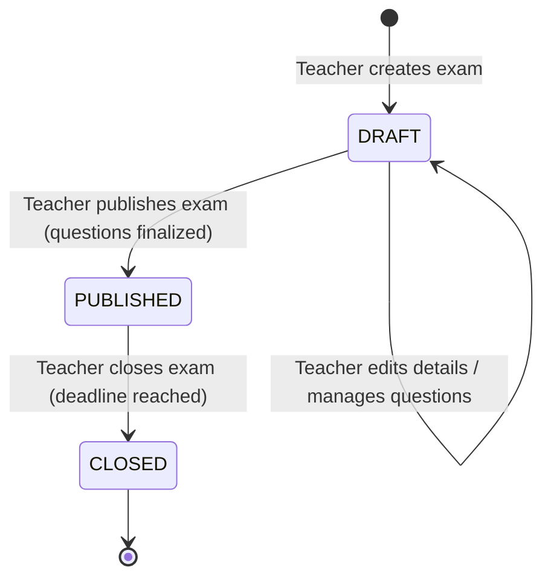
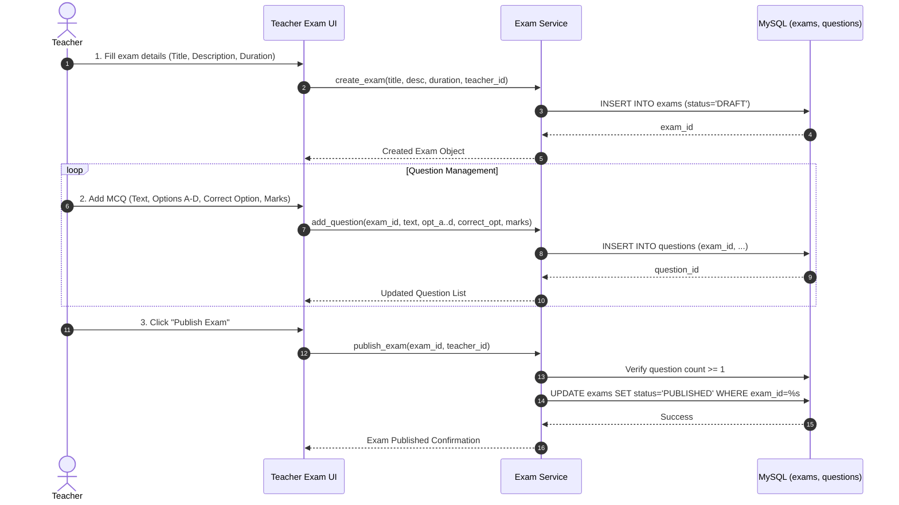
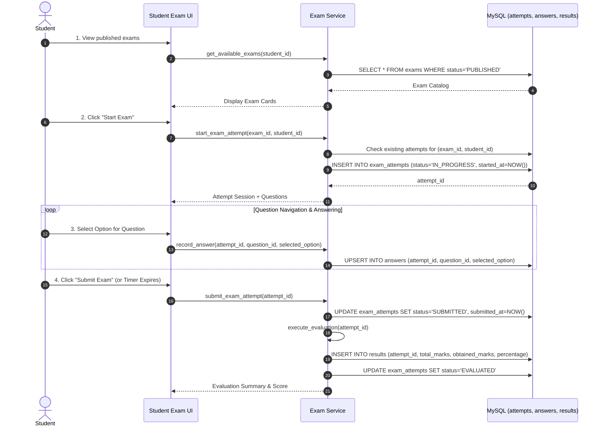
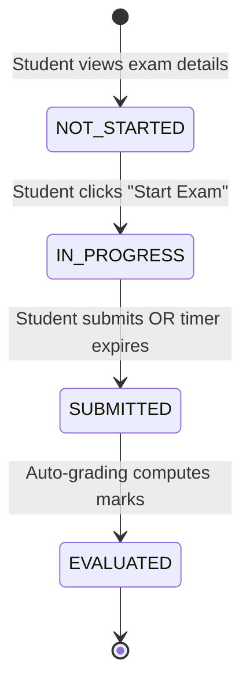
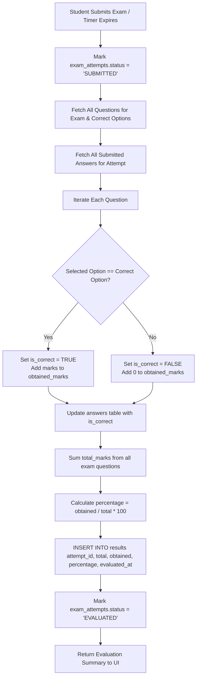

# Phase 4 — Core Examination System Design Specification

## 1. Purpose and Scope

The **Core Examination System** constitutes the functional operational engine of OmniSight-AI. Its purpose is to deliver an online examination workflow supporting teacher-driven examination administration and student-driven examination taking, response recording, and objective evaluation.

### 1.1 Scope
The Core Examination System is responsible for:
- Examination creation, configuration, and lifecycle management by teachers.
- Multiple-Choice Question (MCQ) authoring with option definitions and answer keys.
- Cataloging published examinations accessible to enrolled students.
- Lifecycle tracking of examination attempts (session initiation, timing, completion).
- Atomic response recording and validation.
- Deterministic, automatic grading of objective MCQ submissions and result persistence.
- Role-based authorization isolating student and teacher workflows.

### 1.2 Explicit Non-Scope for Phase 4
As mandated by the master project principles and architecture roadmap, Phase 4 focuses **strictly on the assessment engine**. The following components are explicitly excluded from Phase 4 and reserved for subsequent phases:
- **No AI Proctoring or Webcam Capture** (Phase 5).
- **No Computer Vision / Face Detection** (Phase 5).
- **No Behavioral Feature Extraction** (Phase 6).
- **No Machine Learning Models or Risk Prediction** (Phase 7).
- **No Integrity Dashboards or Suspicious Event Scoring** (Phase 8).

---

## 2. Exam Lifecycle

An examination progresses through three discrete operational states: `DRAFT`, `PUBLISHED`, and `CLOSED`.



### 2.1 State Definitions & Transition Rules

| State | Allowed Operations | Student Visibility & Access | Valid Transitions |
| :--- | :--- | :--- | :--- |
| **`DRAFT`** | Teacher can edit title, description, duration, and add/edit/delete questions. | Hidden from students. No student can view or attempt the exam. | $\rightarrow$ `PUBLISHED` |
| **`PUBLISHED`**| Teacher can view live attempt counts and student submissions. Exam content is locked to prevent structural invalidation of active attempts. | Visible in the student exam catalog. Eligible students may start and submit attempts. | $\rightarrow$ `CLOSED` |
| **`CLOSED`** | Teacher can view complete scoreboard, submissions, and evaluated results. | Visible in read-only mode. New attempts are blocked. Existing completed results remain accessible. | None (Terminal state for active testing) |

---

## 3. Teacher Workflow

Teachers design, configure, and administer examinations through a dedicated interface.



### Step-by-Step Teacher Flow:
1. **Create Examination**: Teacher defines title, instructions/description, and duration in minutes. The record is initialized with status `DRAFT`.
2. **Configure Questions**: Teacher adds objective MCQs specifying:
   - Question text
   - Four discrete option choices (Option A, Option B, Option C, Option D)
   - The correct choice (`A`, `B`, `C`, or `D`)
   - Mark weight (default: 1.0)
3. **Review & Validate**: System displays the draft question roster, verifying that at least one question exists and every question has a valid answer key.
4. **Publish Examination**: Teacher toggles the status to `PUBLISHED`, releasing the examination to student dashboards.

---

## 4. Student Workflow

Students view assigned examinations, attempt questions under time constraints, and review results.



### Step-by-Step Student Flow:
1. **Catalog Browsing**: The student dashboard displays all active `PUBLISHED` exams with details on title, duration, and total questions.
2. **Attempt Initialization**: Clicking "Start Exam" triggers attempt verification:
   - System checks if the student has already submitted an attempt.
   - If allowed, a new `exam_attempts` record is inserted with `status = 'IN_PROGRESS'` and `started_at = NOW()`.
3. **Question Interaction & Timer**:
   - The UI presents questions and tracks elapsed duration against `exams.duration_minutes`.
   - Selected options (`A`, `B`, `C`, or `D`) are recorded via asynchronous/form submissions into `answers`.
4. **Submission**:
   - The exam completes via explicit student submission OR automatic submission when the duration expires.
   - `exam_attempts.submitted_at` is set to the current timestamp.
5. **Immediate Result Presentation**:
   - The evaluation pipeline scores the objective questions instantly.
   - The student views obtained marks, total marks, percentage, and attempt metadata.

---

## 5. Exam Attempt Lifecycle

An examination attempt tracks the concrete participation of an individual student in a specific examination.



### 5.1 Attempt States & Meanings

| Attempt State | Definition | System Behavior |
| :--- | :--- | :--- |
| **`NOT_STARTED`** | Virtual pre-attempt state. The student is authorized to view the exam metadata but has not commenced. | No database record in `exam_attempts` exists yet. |
| **`IN_PROGRESS`** | Student has initiated the exam. Timer is actively elapsing. | `started_at` timestamp recorded. Responses to questions are actively accepted and persisted in `answers`. |
| **`SUBMITTED`** | Student clicked "Submit" or server-side deadline was reached. | `submitted_at` timestamp recorded. Further answer modifications are rejected. |
| **`EVALUATED`** | Objective answers have been matched against correct options, and marks have been totaled. | `results` record persisted with final marks and percentage score. Results are locked and queryable. |

---

## 6. Architecture & Separation of Concerns

The module adheres to a strict four-layer decoupled architecture:

```text
┌─────────────────────────────────────────────────────────────┐
│                    Presentation Layer                       │
│  - Streamlit UI Views (Student Exam Portal, Teacher Studio) │
│  - Timer Widget, Question Cards, Result Scorecard           │
└──────────────────────────────┬──────────────────────────────┘
                               │ Calls
                               ▼
┌─────────────────────────────────────────────────────────────┐
│                  Examination Service Layer                  │
│  - Business Rules, State Transitions, Duration Enforcement  │
│  - Scoring Logic, Answer Validation, Input Sanitization     │
└──────────────┬──────────────────────────────┬───────────────┘
               │ Uses                         │ Validates Identity
               ▼                              ▼
┌──────────────────────────────┐ ┌────────────────────────────┐
│      Database Access Layer   │ │ Authentication & Session   │
│  - MySQL Connection Pool     │ │  - st.session_state        │
│  - Parameterized Queries (%s)│ │  - User ID & Role Checks   │
└──────────────────────────────┘ └────────────────────────────┘
```

### Layer Responsibilities:
1. **Presentation Layer (`src/ui/`)**:
   - Renders Streamlit layouts (navigation, question selectors, countdown timers, scorecards).
   - Zero SQL execution; zero direct password/cryptographic handling.
   - Delegates all operations to the service layer.
2. **Examination Service Layer (`src/exam/service.py`)**:
   - Encapsulates all domain workflows: `create_exam()`, `publish_exam()`, `start_attempt()`, `record_answer()`, `submit_and_evaluate_attempt()`.
   - Performs server-side validations: prevents duplicate attempts, checks exam status, and computes scores.
3. **Database Access Layer (`src/database/connection.py`)**:
   - Manages connection lifecycle and executes parameterized SQL statements against MySQL.
4. **Authentication & Session Integration (`src/auth/session.py`)**:
   - Injects the authenticated `user_id` and verifies RBAC roles before any exam action is allowed.

---

## 7. Database Entity Mapping (Existing Schema Parity)

The Core Examination System operates **strictly within the 6 already-implemented tables** in `database/schema.sql`:

```text
 ┌──────────────┐
 │    users     │
 └──────┬───────┘
        │
        ├───(1:N)───► exams [created_by -> users.id]
        │               │
        │               ├───(1:N)───► questions [exam_id -> exams.exam_id]
        │               │               │
        │               │               └──(1:N)──┐
        │               ▼                         │
        └───(1:N)───► exam_attempts               ▼
                        │ (1:N)               answers
                        ├─────────────────────────┘
                        │
                        └───(1:1)───► results [attempt_id UNIQUE]
```

### Table Roles in Phase 4:
1. **`users`**: Provides identity for the creator (`created_by`) and examinee (`student_id`).
2. **`exams`**: Stores title, description, duration in minutes, status (`DRAFT`, `PUBLISHED`, `CLOSED`), and owner ID.
3. **`questions`**: Stores 4 options (`option_a` through `option_d`), `correct_option` (`A`, `B`, `C`, or `D`), and point weight (`marks`).
4. **`exam_attempts`**: Stores the exam attempt instance, start/end timestamps, and attempt lifecycle status.
5. **`answers`**: Stores the student's selected option for each question and records evaluation outcome (`is_correct`).
6. **`results`**: Enforces a strict 1:1 relationship with `exam_attempts` (via `attempt_id UNIQUE`), storing `total_marks`, `obtained_marks`, `percentage`, and `evaluated_at`.

---

## 8. Authentication & Role-Based Access Control (RBAC) Integration

The examination system builds directly upon the existing `src/auth/session.py` RBAC functions:

| Operation | Required Role | RBAC Enforcement Mechanism |
| :--- | :--- | :--- |
| **Create Exam** | `teacher`, `admin` | `require_role(["teacher", "admin"])` |
| **Manage Draft Questions** | `teacher` (Owner), `admin` | Verified `created_by == current_user["id"]` |
| **Publish / Close Exam** | `teacher` (Owner), `admin` | Verified `created_by == current_user["id"]` |
| **View Exam Submissions**| `teacher` (Owner), `admin` | Verified `created_by == current_user["id"]` |
| **Browse Available Exams**| `student` | `require_role(["student"])` |
| **Start & Submit Attempt**| `student` | `require_role(["student"])` |
| **View Own Result** | `student` (Examinee) | Verified `attempt.student_id == current_user["id"]` |

---

## 9. Answer Submission and Automatic Evaluation Pipeline

Objective evaluation is deterministic, immediate, and atomic upon submission:



### Evaluation Equations:
$$\text{Total Marks} = \sum_{q \in \text{Questions}} q.\text{marks}$$

$$\text{Obtained Marks} = \sum_{a \in \text{Answers} \mid a.\text{is\_correct} = \text{TRUE}} q(a).\text{marks}$$

$$\text{Percentage} = \left(\frac{\text{Obtained Marks}}{\text{Total Marks}}\right) \times 100$$

*(Results are formatted to 2 decimal places matching MySQL `DECIMAL(7,2)` and `DECIMAL(5,2)` column definitions).*

---

## 10. Data Relationship Flow: Exam $\rightarrow$ Questions $\rightarrow$ Attempt $\rightarrow$ Answers $\rightarrow$ Result

```text
EXAM (1)
  │
  ├──► [1..N] QUESTIONS
  │             │
  │             │ (Graded against)
  │             ▼
  └──► [1..N] EXAM ATTEMPTS (1 per student session)
                │
                ├──► [1..N] ANSWERS (Recorded student selections)
                │             │
                │             ▼ (Aggregated into)
                └──► [1..1] RESULT (Final objective score)
```

1. **`Exam`** defines the test specification.
2. **`Questions`** populate the exam with content and define the evaluation benchmark (`correct_option`).
3. **`Exam Attempt`** instantiates an active session for an individual student.
4. **`Answers`** link the student's attempt to specific questions, recording choices.
5. **`Result`** synthesizes all evaluated answers into a permanent academic grade tied 1:1 to the attempt.

---

## 11. Integration Boundary for Future Phases

The `exam_attempts` record serves as the foundational relational anchor for all monitoring and AI components in later phases:

```text
Phase 4 (Core Exam)        Phase 5 (Monitoring/CV)      Phase 6 (Behavioral)       Phase 7 (ML & Risk)
┌─────────────────┐        ┌───────────────────┐        ┌─────────────────────┐   ┌───────────────────────┐
│  exam_attempts  │───────►│ monitoring_events │───────►│ behavioral_features │──►│ integrity_assessments │
└─────────────────┘ (1:N)  └───────────────────┘ (Agg)  └─────────────────────┘   └───────────────────────┘
```

- In **Phase 5**, the webcam monitoring service will insert detected events (`NO_FACE`, `MULTIPLE_FACES`) directly using `attempt_id`.
- In **Phase 6**, behavioral signals (event frequencies, switch counts) will aggregate using `attempt_id`.
- In **Phase 7**, ML inference models will calculate integrity risk scores and record outcomes into `integrity_assessments` referencing `attempt_id`.

Because Phase 4 establishes clean, immutable `attempt_id` keys, subsequent phases integrate modularly without altering examination logic.

---

## 12. Design Decisions & Assumptions

1. **Single Attempt per Student per Exam (MVP Rule)**:
   - *Decision*: In the academic MVP, a student is restricted to one completed attempt per published exam.
   - *Rationale*: Prevents answer key leaks and ensures clean 1:1 attempt-to-result mapping for vivas and demonstrations.
2. **Server-Side Deadline Verification**:
   - *Decision*: The submission timestamp is validated server-side against `started_at + duration_minutes + grace_period` (e.g. 60 seconds for network latency).
   - *Rationale*: Client-side JavaScript timers can be paused or manipulated; server-side validation guarantees fairness.
3. **Draft Locking**:
   - *Decision*: Once an exam is toggled to `PUBLISHED`, adding or deleting questions is disabled.
   - *Rationale*: Changing questions mid-exam would corrupt in-progress attempts and invalidate proportional scoring.
4. **Immediate Objective Grading**:
   - *Decision*: Scoring executes synchronously during final submission.
   - *Rationale*: MCQs require no manual teacher grading, providing immediate student feedback and populating `results` instantaneously.
5. **Zero New Database Migrations**:
   - *Decision*: Operates completely within the existing, verified `omnisight_ai` database schema.
