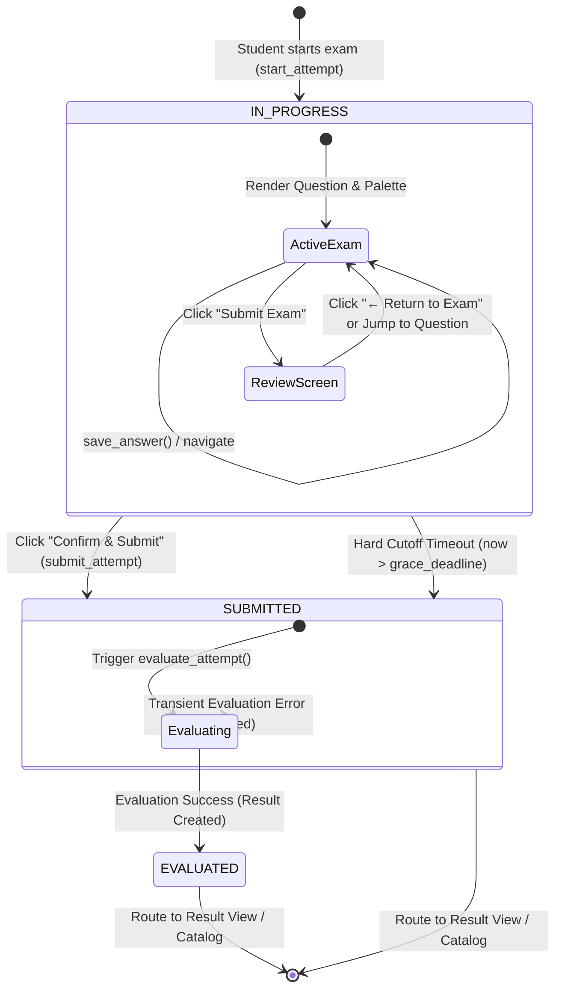
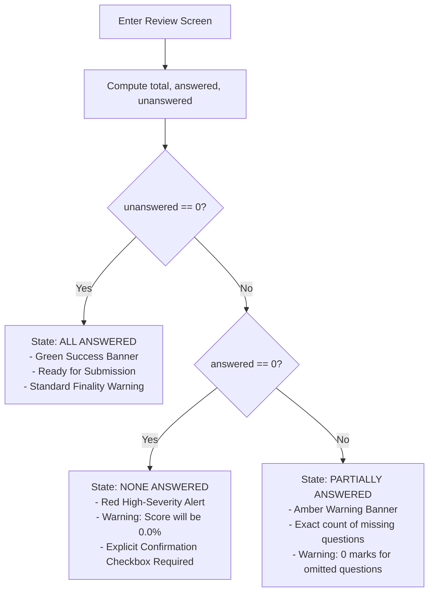
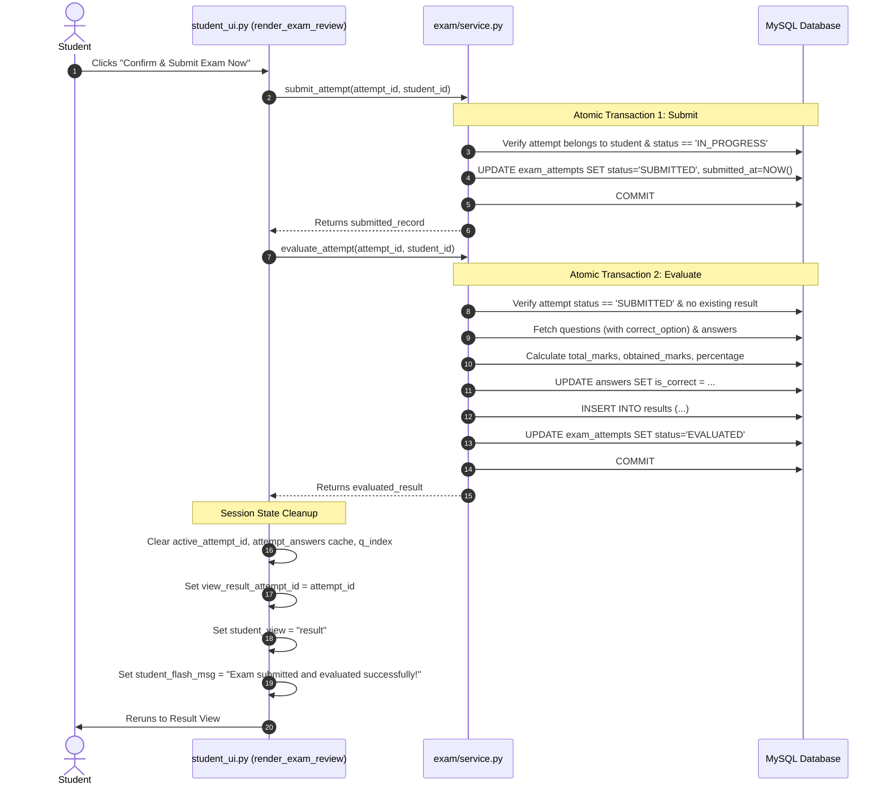

# OmniSight-AI — Active Examination Interface Design Specification
## Part 2B-4: Manual Submission & Exam Review Confirmation Flow

---

## 1. Purpose and Scope

Following the implementation and verification of:
- **Part 2B-1**: Active Exam Foundation & Question Rendering
- **Part 2B-2**: Option Selection, Answer Persistence & Question Navigation
- **Part 2B-3**: Server-Side Deadline Governance & Client Countdown Timer

This document establishes the detailed architectural and technical design for **Part 2B-4: Manual Submission & Exam Review Confirmation Flow**.

In high-stakes academic examinations, terminating an active exam attempt requires a deterministic, transparent, and irreversible lifecycle transition. Students must never be subjected to accidental, one-click submissions that destroy their opportunity to complete the exam. Simultaneously, the submission process must provide a comprehensive pre-submission review screen displaying exact question completion states, enforce deadline governance throughout the review process, invoke authoritative service-layer submission and automated evaluation, and guarantee that no answer mutations can occur after submission.

### 1.1 In-Scope for Part 2B-4
1. **Manual Submission Initiation**: Clear, deliberate user action from the active examination interface to initiate the submission sequence.
2. **Pre-Submission Review Interface**: Dedicated, comprehensive confirmation screen displaying:
   - Exam metadata (Title, Attempt ID, Duration).
   - Summary statistics (Total Questions, Answered Questions, Unanswered Questions).
   - High-visibility warning alert indicating that final submission is irreversible.
   - Question-by-question breakdown table/card listing Question Number, Question Text Snippet, Answer Status (Selected Option vs. Unanswered), and a direct "Return to Question" navigation jump action.
3. **Completion State Adaptations**:
   - *All Questions Answered*: Positive readiness indicator and submission encouragement.
   - *Some Questions Unanswered*: Prominent amber warning with exact unanswered count and notification of zero-mark penalty for unanswered items.
   - *Zero Questions Answered*: High-severity red warning requiring explicit student acknowledgement before submitting a blank exam.
4. **Cancellation & Exam Resumption**: Seamless "← Return to Exam" action returning the student to the active exam interface with the question index and all persisted answers intact.
5. **Continuous Deadline Governance**:
   - Strict adherence to Part 2B-3 server-side timing authority during the review screen.
   - Visual display of authoritative countdown timer on the review screen.
   - Automatic submission interception if the official deadline and 60-second grace window expire while reviewing.
6. **Authoritative Service-Layer Submission**:
   - Exclusive reuse of `src/exam/service.py:submit_attempt(attempt_id, student_id)`.
   - Zero SQL statements, direct database queries, or duplicate status mutations in `src/ui/student_ui.py`.
7. **Immediate Automated Evaluation Pipeline**:
   - Coordinated invocation of `src/exam/service.py:evaluate_attempt(attempt_id, student_id)` immediately following successful submission.
   - Clean lifecycle progression: `IN_PROGRESS` $\to$ `SUBMITTED` $\to$ `EVALUATED`.
   - Fault-tolerant error handling if evaluation fails, ensuring the attempt remains safely locked as `SUBMITTED`.
8. **Permanent Answer Immutability**:
   - Rejection of all subsequent `save_answer()` requests once marked `SUBMITTED`.
   - Barring re-entry to the active exam or review screens for finalized attempts.
9. **Post-Submission Routing & Result Transition**:
   - Immediate routing to `student_view = "result"` (or catalog with flash confirmation).
   - Cleanup of attempt-specific transient session states.
10. **Reconnection & Refresh Resilience**:
    - Complete reconstruction of review state from database queries on browser reload or network interruption.

### 1.2 Explicit Non-Scope for Part 2B-4
- **No Result Scorecard UI Overhaul**: Full score visualization and analytics are assigned to **Part 2C**. Part 2B-4 routes to the result view and confirms score generation.
- **No Proctoring / MediaPipe / OpenCV**: Zero webcam access, computer vision, gaze estimation, or face detection (Phase 5).
- **No Behavioral Telemetry**: Zero keystroke cadence, mouse tracking, or tab-switch detection (Phase 6).
- **No Machine Learning**: Zero anomaly detection, integrity risk scoring, or model inference (Phases 7–8).
- **No Database Schema Changes**: Zero modifications to existing MySQL tables, columns, indexes, or stored procedures.

---

## 2. Examination Lifecycle & State Machine



### 2.1 State Definitions and Transitions

| State | Allowed Student Actions | Data Mutations Permitted | Timing Authority |
| :--- | :--- | :--- | :--- |
| **`IN_PROGRESS` (Active)** | View questions, select options, clear options, navigate, jump via palette, initiate review. | `answers` table (INSERT / UPDATE). | Server clock vs. `started_at + duration_minutes`. |
| **`IN_PROGRESS` (Review)** | View summary metrics, inspect answer table, jump back to question, confirm submission. | None (read-only inspection of persisted answers). | Server clock vs. `started_at + duration_minutes`. |
| **`SUBMITTED`** | None (read-only). Attempt is locked against all modifications. | `exam_attempts` (`status = 'SUBMITTED'`, `submitted_at = NOW()`). | Frozen at `submitted_at`. |
| **`EVALUATED`** | View final score, percentage, marks breakdown (in Part 2C). | `results` table (INSERT 1 row), `answers` table (`is_correct`), `exam_attempts` (`status = 'EVALUATED'`). | N/A (Terminated). |

### 2.2 Invariant Guarantees
1. **Unidirectional Transition**: An attempt can only move forward: `IN_PROGRESS` $\to$ `SUBMITTED` $\to$ `EVALUATED`. It can never be reverted to `IN_PROGRESS`.
2. **Answer Locking**: The moment `submit_attempt()` executes, `save_answer()` is unconditionally locked. Even if a delayed network packet arrives containing an answer selection, `save_answer()` rejects it with `ValueError("Cannot save answer: Attempt status is 'SUBMITTED'.")`.
3. **Single Result Record**: `evaluate_attempt()` enforces that exactly one result record exists per attempt. Duplicate evaluations are rejected.

---

## 3. Pre-Submission Review Interface Specification

### 3.1 Initiating Submission from Active Exam
In `render_active_exam()`, the student is provided with two explicit methods to access the review screen:
1. **Primary Action Button in Navigation Row**:
   - On the final question ($index == len(questions) - 1$), the primary action button transitions from "Save & Next →" to **"Review & Submit Exam →"** (or a dedicated "Submit Exam" button).
2. **Global Submission Header / Footer Button**:
   - Below the Question Palette, a full-width container provides:
     - Button: **"🏁 Review & Submit Examination"** (`type="primary"`, `use_container_width=True`).
     - Tooltip/Caption: *"Inspect your answered and unanswered questions before final submission."*
3. **Action Handler**:
   - When clicked, `st.session_state["student_view"] = "review_exam"`.
   - The UI re-executes (`st.rerun()`), immediately rendering the review screen.

```text
+----------------------------------------------------------------------------------------------------+
|                                    ACTIVE EXAMINATION INTERFACE                                    |
|                                                                                                    |
|  [ Question 5 of 5 ]                                             Points: 1 Mark | ⏳ Time: 18:42   |
|  ... Question Content & Radio Options ...                                                          |
|  [ ← Previous ]                  [ Clear Selection ]                   [ 🏁 Review & Submit Exam ] |
|                                                                                                    |
|  --------------------------------- QUESTION PALETTE ----------------------------------------------  |
|  [✓ 1]  [✓ 2]  [● 3]  [4]  [5]                                                                     |
|                                                                                                    |
|  [ 🏁 Proceed to Review & Final Submission ]                                                       |
+----------------------------------------------------------------------------------------------------+
```

---

### 3.2 Review Screen Layout & Structure

When `student_view == "review_exam"`, the dedicated presentation function `render_exam_review(student_id, attempt_id)` is invoked. It contains six structured visual blocks:

```text
+----------------------------------------------------------------------------------------------------+
| 🏁 Examination Submission Review                                                    [Attempt #19]  |
| CS101 — Introduction to Computer Science                                            ⏳ Time: 18:20  |
+----------------------------------------------------------------------------------------------------+
| ⚠️ IRREVERSIBLE SUBMISSION WARNING                                                                 |
| Submitting your examination is permanent. Once submitted, you cannot change any answers or        |
| return to this examination. Please review your answers carefully before confirming.               |
+----------------------------------------------------------------------------------------------------+
|  +-------------------------+  +-------------------------+  +-------------------------+             |
|  |     Total Questions     |  |   Answered Questions    |  |  Unanswered Questions   |             |
|  |           10            |  |       8 / 10 (80%)      |  |            2            |             |
|  +-------------------------+  +-------------------------+  +-------------------------+             |
+----------------------------------------------------------------------------------------------------+
| [ COMPLETION STATUS NOTICE ]                                                                       |
| ⚠️ Attention: You have 2 unanswered questions. Unanswered questions will receive 0 marks.           |
+----------------------------------------------------------------------------------------------------+
| QUESTION SUMMARY BREAKDOWN:                                                                        |
| +----+-----------------------------------------------+-----------+-------------------------------+ |
| | #  | Question Summary                              | Status    | Action                        | |
| +----+-----------------------------------------------+-----------+-------------------------------+ |
| | 1  | What is the primary purpose of an operating...| Option B  | [ Edit / View Question ]      | |
| | 2  | Which data structure uses LIFO ordering?      | Option A  | [ Edit / View Question ]      | |
| | 3  | In relational databases, what is a foreign... | UNANSWERED| [ Answer Question Now ]       | |
| | 4  | What is the worst-case time complexity of...  | Option C  | [ Edit / View Question ]      | |
| | 5  | Which protocol operates at the Transport layer| UNANSWERED| [ Answer Question Now ]       | |
| +----+-----------------------------------------------+-----------+-------------------------------+ |
+----------------------------------------------------------------------------------------------------+
| ACTIONS:                                                                                           |
| [ ← Return to Exam ]                                              [ 🚨 Confirm & Submit Exam Now ] |
+----------------------------------------------------------------------------------------------------+
```

---

### 3.3 Visual Warning & Completion State Semantics

The review interface dynamically configures its warning banners and callout alerts based on completion status:



#### Detailed State Specifications:
1. **State 1: All Questions Answered (`unanswered == 0`)**:
   - **Banner Style**: `st.success`
   - **Message**: *"✅ Excellent! You have answered all questions ({total}/{total}). Please verify your answers below and click 'Confirm & Submit Exam Now' when ready."*
   - **Submit Button**: Active, primary styling (`type="primary"`).

2. **State 2: Partially Answered (`unanswered > 0 and answered > 0`)**:
   - **Banner Style**: `st.warning`
   - **Message**: *"⚠️ Warning: You have {unanswered} unanswered question(s) out of {total}. Unanswered questions will receive 0 marks. You can click 'Answer Question Now' on any unanswered question to complete it before submitting."*
   - **Submit Button**: Active, primary styling (`type="primary"`).

3. **State 3: Zero Questions Answered (`answered == 0`)**:
   - **Banner Style**: `st.error`
   - **Message**: *"🚨 Critical Alert: You have NOT answered any questions (0/{total}). Submitting now will finalize your attempt with an obtained score of 0.0 marks."*
   - **Confirmation Guard**: An explicit acknowledgement checkbox is displayed:
     - `st.checkbox("I acknowledge that I am submitting an empty examination with 0 answers.", key="confirm_empty_submit")`
     - The submit button is `disabled` until the checkbox is checked.

---

## 4. Authoritative Timing Governance on the Review Screen

A critical vulnerability in poorly designed online examination platforms is timer abandonment on modal/review pages. In OmniSight-AI:

> **The review screen is under the exact same server-side deadline and grace governance as the active question screen. Time continues to elapse.**

### 4.1 Timing Re-evaluation on Review Entry
Every execution of `render_exam_review()` performs the authoritative timing check against the application server clock:
```python
started_at = attempt["started_at"]
duration_minutes = exam.get("duration_minutes", 0)
official_deadline = started_at + timedelta(minutes=duration_minutes)
grace_deadline = official_deadline + timedelta(seconds=60)
now = datetime.now()

# 1. Hard Cutoff Interception
if now > grace_deadline:
    auto_submit_key = f"auto_submit_handled_{attempt_id}"
    if not st.session_state.get(auto_submit_key, False):
        st.session_state[auto_submit_key] = True
        try:
            submit_attempt(attempt_id, student_id)
            evaluate_attempt(attempt_id, student_id)
        except Exception:
            pass
    st.session_state["student_flash_msg"] = (
        "Your examination time expired while reviewing. Your attempt has been automatically submitted and evaluated."
    )
    st.session_state["active_attempt_id"] = None
    st.session_state["view_result_attempt_id"] = attempt_id
    st.session_state["student_view"] = "result"
    st.rerun()
    return
```

### 4.2 Grace Period Presentation on Review Screen
- If `official_deadline < now <= grace_deadline`:
  - A prominent crimson alert is rendered at the top:
    ```
    ⏰ Official examination time has concluded. You are in the 60-second grace window (XXs remaining).
    Submit your examination immediately before the hard cutoff.
    ```
  - Return-to-exam navigation is disabled or restricted to prevent question editing when official time has lapsed.
  - The submit button label updates to: **"Finalize & Submit Exam Now"**.

---

## 5. Submission Execution & Post-Submission Pipeline



### 5.1 Step-by-Step Transition Protocol

1. **Step 1: User Confirmation Trigger**:
   - The student clicks the submission button.
   - An in-flight submission flag `is_submitting_{attempt_id}` is set in `st.session_state` to prevent double-click duplicate requests.

2. **Step 2: Submission Execution (`submit_attempt`)**:
   - The UI invokes:
     ```python
     submitted_attempt = submit_attempt(attempt_id, student_id)
     ```
   - **Service Guarantees**:
     - Ownership: `attempt["student_id"] == student_id`.
     - Status: `attempt["status"] == "IN_PROGRESS"`.
     - Mutation: `status = 'SUBMITTED'`, `submitted_at = NOW()`.
     - Atomicity: Committed immediately.

3. **Step 3: Immediate Automated Evaluation (`evaluate_attempt`)**:
   - Immediately following successful submission, the UI calls:
     ```python
     try:
         evaluation_result = evaluate_attempt(attempt_id, student_id)
     except Exception as eval_err:
         # Non-blocking fallback: attempt is already SUBMITTED
         logger.error(f"Post-submission evaluation deferred: {eval_err}")
     ```
   - **Service Guarantees**:
     - Pre-condition: Attempt status must be `SUBMITTED`.
     - Processing: Computes obtained marks against masked question keys.
     - Persists: Result record inserted, answers marked with `is_correct`, attempt transitioned to `EVALUATED`.

4. **Step 4: Transient State Sanitization**:
   - Clear attempt-scoped state variables:
     ```python
     st.session_state.pop(f"attempt_answers_{attempt_id}", None)
     st.session_state.pop(f"q_index_{attempt_id}", None)
     st.session_state.pop(f"auto_submit_handled_{attempt_id}", None)
     st.session_state["active_attempt_id"] = None
     ```

5. **Step 5: Routing to Result View**:
   - Route to result view:
     ```python
     st.session_state["view_result_attempt_id"] = attempt_id
     st.session_state["student_view"] = "result"
     st.session_state["student_flash_msg"] = (
         "🎉 Examination submitted successfully! Your attempt has been evaluated."
     )
     st.rerun()
     ```

---

## 6. Service-Layer Sufficiency Analysis (Architectural Decision)

### 6.1 Question: Is a New Service Query or Schema Helper Needed?
To render the pre-submission review screen, the UI needs:
1. Attempt status, start time, exam ID $\to$ provided by `get_attempt(attempt_id, student_id)`.
2. Exam title, description, duration $\to$ provided by `get_exam(exam_id)`.
3. List of exam questions (text, marks, question_id) $\to$ provided by `get_attempt_questions(attempt_id, student_id)` (with `correct_option` securely masked).
4. Persisted student answers $\to$ provided by `get_attempt_answers(attempt_id, student_id)` returning `{question_id: selected_option}`.

### 6.2 Architectural Evaluation
- **Data Volume**: Academic examinations in OmniSight-AI contain between 5 and 100 questions.
- **Computation**: Computing `total = len(questions)`, `answered = sum(1 for q in questions if qid in answers)`, and `unanswered = total - answered` is an $O(N)$ in-memory operation executing in $< 0.1$ milliseconds.
- **Service Isolation**: All required underlying data is already cleanly retrieved using existing secure service methods.
- **Decision**:
  > **No new service query, no new SQL statements, and no database schema changes are required.** The presentation layer will compute the review metrics in memory from the authoritative service outputs.

---

## 7. Edge Cases & Resilience Engineering

| Edge Case / Failure Scenario | System Behavior & Mitigation |
| :--- | :--- |
| **Double-Click Submission** | The submit button is wrapped with a single-submission guard in session state (`st.session_state[f"submitting_{attempt_id}"] = True`). Furthermore, `submit_attempt()` rejects any attempt not in `IN_PROGRESS` with `ValueError`, guaranteeing idempotency. |
| **Timer Expiration on Review Screen** | Checked on every rerun. If `now > grace_deadline`, auto-submits via service layer, sets flash message, and immediately routes to results. |
| **Student Refreshes Review Screen** | `render_student_ui()` detects `student_view == "review_exam"`, re-fetches attempt, answers, and questions from the database, re-computes deadline and metrics. State is completely preserved. |
| **Attempt Already Submitted (e.g., in other tab)** | `get_attempt()` returns `status == 'SUBMITTED'` or `'EVALUATED'`. The UI immediately detects this terminal state, displays an informative message, and routes to result view. |
| **Evaluation Error After Submission** | If `evaluate_attempt()` raises a transient database error, the attempt remains safely locked as `SUBMITTED`. The student is routed to catalog/result with a notice that results are pending. Academic integrity is preserved. |
| **Student Returns to Exam to Modify Answer** | Clicking "Edit / View Question" sets `st.session_state[f"q_index_{attempt_id}"] = target_index`, changes `student_view = "active_exam"`, and triggers `st.rerun()`. Answer editing proceeds normally via Part 2B-2 controls. |
| **Blank Exam Submission (0 answers)** | Permitted only after the student checks the explicit acknowledgment checkbox: *"I acknowledge that I am submitting an empty examination with 0 answers."* Prevents catastrophic accidental clicks. |

---

## 8. Role-Based Access Control & Security Boundaries

1. **Role Verification**:
   - `render_exam_review()` and `submit_attempt()` strictly require the authenticated user to hold the `student` role (`require_role(["student"])`).
2. **Attempt Ownership Verification**:
   - `submit_attempt(attempt_id, student_id)` and `evaluate_attempt(attempt_id, student_id)` enforce `attempt["student_id"] == student_id`. Cross-student submission is rejected with `PermissionError`.
3. **Answer Key Protection**:
   - Question texts and options displayed on the review screen are sourced exclusively from `get_attempt_questions()`, which completely omits `correct_option` from the SQL projection.
4. **Answer Immutability Guarantee**:
   - Once submitted, the attempt record has `status = 'SUBMITTED'`. Any attempt to call `save_answer()` is rejected at the database transaction level.

---

## 9. Session State Specification

The following `st.session_state` keys are utilized during Part 2B-4:

| Key | Type | Purpose | Lifecycle |
| :--- | :--- | :--- | :--- |
| `student_view` | `str` | View router (`"catalog"`, `"instructions"`, `"active_exam"`, `"review_exam"`, `"result"`). | Persists across student navigation; cleared on logout. |
| `active_attempt_id` | `int` or `None` | ID of the current active attempt. | Cleared upon final submission. |
| `view_result_attempt_id` | `int` or `None` | ID of attempt to display in result view. | Set upon final submission. |
| `attempt_answers_{attempt_id}` | `Dict[int, str]` | Cache of persisted answers `{question_id: option}`. | Populated from service; cleared after submission. |
| `q_index_{attempt_id}` | `int` | Active question index (0-based). | Retained when jumping between review and active exam; cleared after submission. |
| `auto_submit_handled_{attempt_id}` | `bool` | Idempotency flag for deadline auto-submission. | Cleared after submission. |
| `confirm_empty_submit` | `bool` | Checkbox state for acknowledging 0-answer submission. | Ephemeral to review screen. |

---

## 10. Verification Plan & Test Scenarios

### 10.1 Automated Verification Suite (`verify_part_2b4.py`)
A comprehensive, end-to-end regression script will be created to validate the entire workflow against real MySQL operations:

1. **Test Case 1: Complete Exam Submission Flow**:
   - Create student user, exam, and 3 questions.
   - Start attempt (`IN_PROGRESS`).
   - Answer all 3 questions (`save_answer`).
   - Verify review metrics: `total=3`, `answered=3`, `unanswered=0`.
   - Submit attempt (`submit_attempt`) $\to$ Status becomes `SUBMITTED`, answers immutable.
   - Evaluate attempt (`evaluate_attempt`) $\to$ Status becomes `EVALUATED`, result record created with correct score.
2. **Test Case 2: Partial Exam Submission Flow**:
   - Create student user, exam, and 4 questions.
   - Answer only questions 1 and 3.
   - Verify review metrics: `total=4`, `answered=2`, `unanswered=2`.
   - Submit and evaluate attempt $\to$ Unanswered questions graded as incorrect, correct score computed.
3. **Test Case 3: Empty Exam Submission Flow**:
   - Create student user, exam, and 2 questions.
   - Zero answers saved.
   - Verify review metrics: `total=2`, `answered=0`, `unanswered=2`.
   - Submit and evaluate $\to$ Score is 0.0 marks (0.0%).
4. **Test Case 4: Answer Immutability Enforcement**:
   - Verify calling `save_answer()` on a `SUBMITTED` or `EVALUATED` attempt raises `ValueError`.
5. **Test Case 5: Re-submission & Re-evaluation Rejection**:
   - Verify calling `submit_attempt()` on an already-submitted attempt raises `ValueError`.
   - Verify calling `evaluate_attempt()` on an already-evaluated attempt raises `ValueError`.
6. **Test Case 6: Navigation Jump Integration**:
   - Verify jumping from review table to a specific question restores `q_index` accurately.
7. **Test Case 7: Clean Session State Post-Submission**:
   - Verify `active_attempt_id` and cache keys are properly scrubbed.

---

## 11. Implementation Plan & File Touchpoints

When approved for implementation:
1. **File to Modify**: `src/ui/student_ui.py`
   - Implement `render_exam_review(student_id: int, attempt_id: int) -> None`.
   - Add `"review_exam"` routing branch in `render_student_ui()`.
   - Integrate "Review & Submit" triggers in `render_active_exam()`.
   - Implement review table with question navigation jump callbacks.
   - Wire submission confirmation to `submit_attempt()` and `evaluate_attempt()`.
2. **Files Unchanged**:
   - `src/exam/service.py`: Zero modifications required (functions already complete and verified).
   - Database schema: Zero changes required.
   - `src/auth/*`: Zero changes required.
